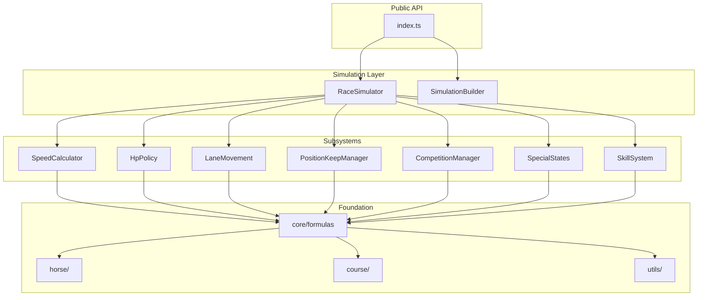

# ADR-001: Domain-Driven Refactoring of Simulation Library

**Date:** 2024-12-20
**Status:** Proposed
**Author:** [Your Name]

---

## Context

The current simulation library at [`src/modules/simulation/lib/`](src/modules/simulation/lib/) has grown organically and now presents significant maintainability challenges:

### Current State Metrics

| File                      | Size | Lines | Issue                              |
| ------------------------- | ---- | ----- | ---------------------------------- |
| `RaceSolver.ts`           | 64KB | 2,077 | God class with 6+ responsibilities |
| `ActivationConditions.ts` | 60KB | 2,113 | Monolithic condition registry      |
| `RaceSolverBuilder.ts`    | 38KB | 1,400 | Builder with mixed concerns        |
| `EnhancedHpPolicy.ts`     | 16KB | 551   | Duplicates logic from utilities    |
| `SpurtCalculator.ts`      | 13KB | 505   | Good separation (model to follow)  |

### Problems

1. **Single Responsibility Violation**: `RaceSolver.ts` handles speed calculation, acceleration, HP management, skill activation, lane movement, position keeping, rushed state, downhill mode, competition mechanics, and more.
2. **Testability**: Testing individual mechanics requires instantiating the entire RaceSolver.
3. **Duplication**: Same formulas exist in multiple files (e.g., guts modifier calculation).
4. **Onboarding Difficulty**: New developers struggle to understand 2,000+ line files.
5. **Modification Risk**: Changes to one mechanic risk breaking unrelated functionality.

### Existing Good Patterns

- `HpPolicy` interface with pluggable implementations (Strategy pattern)
- `SpurtCalculator` as pure calculation utilities
- Type separation in `race-solver/types.ts` and `courses/types.ts`

---

## Decision

Adopt **Domain-Driven Design (DDD)** to reorganize the simulation library into cohesive, single-responsibility modules organized by racing domain.

### Target Architecture

```javascript
src/modules/simulation/lib/
├── index.ts                          # Public API
│
├── core/                             # Constants and pure formulas
│   ├── constants.ts
│   ├── formulas.ts
│   └── types.ts
│
├── physics/                          # Race physics subsystems
│   ├── speed/
│   │   ├── SpeedCalculator.ts
│   │   ├── AccelerationCalculator.ts
│   │   └── index.ts
│   ├── hp/
│   │   ├── HpPolicy.ts
│   │   ├── GameHpPolicy.ts
│   │   ├── EnhancedHpPolicy.ts
│   │   ├── SpurtCalculator.ts
│   │   └── index.ts
│   └── lane/
│       ├── LaneMovementCalculator.ts
│       ├── BlockingDetector.ts
│       └── index.ts
│
├── behavior/                         # AI and state mechanics
│   ├── position-keeping/
│   │   ├── PositionKeepManager.ts
│   │   ├── PacemakerSelector.ts
│   │   └── index.ts
│   ├── competition/
│   │   ├── LeadCompetitionManager.ts
│   │   ├── CompeteFightManager.ts
│   │   └── index.ts
│   └── special-states/
│       ├── RushedStateManager.ts
│       ├── DownhillModeManager.ts
│       └── index.ts
│
├── skills/                           # Skill system
│   ├── activation/
│   │   ├── ConditionParser.ts
│   │   ├── ConditionRegistry.ts
│   │   ├── WisdomChecker.ts
│   │   └── conditions/
│   │       ├── phase.ts
│   │       ├── position.ts
│   │       ├── random.ts
│   │       └── index.ts
│   ├── effects/
│   │   ├── SkillEffectApplicator.ts
│   │   └── index.ts
│   └── types.ts
│
├── simulation/                       # Main orchestrator
│   ├── RaceSimulator.ts             # Refactored RaceSolver
│   ├── SimulationBuilder.ts
│   ├── SimulationState.ts
│   └── index.ts
│
├── horse/
│   ├── HorseParameters.ts
│   ├── StatCalculator.ts
│   └── types.ts
│
├── course/
│   ├── CourseData.ts
│   ├── CourseHelpers.ts
│   └── types.ts
│
└── utils/
    ├── Random.ts
    ├── Region.ts
    ├── Timer.ts
    └── CompensatedAccumulator.ts
```

### Dependency Flow



---

## Consequences

### Positive

- **Testability**: Each subsystem can be unit tested in isolation
- **Maintainability**: Changes to one domain don't risk breaking others
- **Discoverability**: Clear file structure guides developers
- **Reusability**: Subsystems can be used independently
- **Performance**: Lazy loading of unused subsystems possible

### Negative

- **Initial Investment**: Significant refactoring effort (40-60 hours estimated)
- **Breaking Changes**: Internal APIs will change (external API can remain stable)
- **Learning Curve**: Team must learn new structure

### Neutral

- File count increases from ~15 to ~40
- Total lines of code approximately same (just distributed better)

---

## Implementation Plan

### Phase 1: Foundation (Week 1)

Create foundation modules without breaking existing code.**1.1 Create `core/` module**

- Extract constants from `RaceSolver.ts` lines 33-85 to `core/constants.ts`
- Extract pure formulas (baseTargetSpeed, lastSpurtSpeed, acceleration calculations)
- Create `core/types.ts` for shared types

**1.2 Create `utils/` module**

- Move `Random.ts`, `Region.ts` to `utils/`
- Extract `Timer`, `CompensatedAccumulator` classes from `RaceSolver.ts`

**1.3 Reorganize existing modules**

- Move `HorseTypes.ts` to `horse/types.ts`
- Move `CourseData.ts` to `course/`
- Move `RaceParameters.ts` to `core/` or `simulation/`

### Phase 2: Physics Subsystems (Week 2)

**2.1 Create `physics/speed/` module**

- Create `SpeedCalculator.ts` extracting from `RaceSolver.ts`:
- Lines 45-61: `baseTargetSpeed()`
- Lines 63-72: `lastSpurtSpeed()`
- Lines 1472-1520: `updateTargetSpeed()` logic
- Update `RaceSolver.ts` to import and use

**2.2 Create `physics/lane/` module**

- Create `LaneMovementCalculator.ts` extracting:
- Lines 883-954: `applyLaneMovement()`
- Blocking detection logic
- Overtake target calculation

**2.3 Consolidate `physics/hp/` module**

- Move `HpPolicy.ts`, `EnhancedHpPolicy.ts`, `SpurtCalculator.ts`
- Ensure no duplication between files

### Phase 3: Behavior Subsystems (Week 3)

**3.1 Create `behavior/position-keeping/` module**

- Extract from `RaceSolver.ts` lines 1041-1257:
- `applyPositionKeepStates()`
- `updatePositionKeepCoefficient()`
- Pacemaker selection logic (lines 963-1012)

**3.2 Create `behavior/competition/` module**

- Extract `LeadCompetitionManager` from lines 1343-1387
- Extract `CompeteFightManager` from lines 1277-1341

**3.3 Create `behavior/special-states/` module**

- Extract `RushedStateManager` from lines 724-799
- Extract `DownhillModeManager` from lines 1426-1469

### Phase 4: Skill System (Week 4)

**4.1 Split `ActivationConditions.ts`**

- Create `skills/activation/conditions/` directory
- Group related conditions into ~10 files by category
- Create `ConditionRegistry.ts` to aggregate all conditions

**4.2 Create `skills/effects/` module**

- Extract `SkillEffectApplicator.ts` from lines 1824-1949
- Move value/duration scaling logic

### Phase 5: Orchestration (Week 5)

**5.1 Refactor `RaceSimulator.ts`**

- Reduce to ~300-500 lines
- Inject all subsystems via constructor
- Main `step()` method orchestrates subsystems

**5.2 Simplify `SimulationBuilder.ts`**

- Use subsystem factories
- Fluent API for configuration
- Reduce to ~500-700 lines

**5.3 Create public `index.ts`**

- Export only public API
- Hide internal implementation

---

## Migration Strategy

### Backward Compatibility

```typescript
// OLD: Continue to work
import { RaceSolver } from './RaceSolver';

// NEW: Preferred going forward
import { RaceSimulator, SimulationBuilder } from './index';
```

Keep `RaceSolver` as a facade that delegates to new subsystems until fully deprecated.

### Rollback Plan

Each phase creates new modules alongside existing code. If issues arise:

1. Revert new module imports in `RaceSolver.ts`
2. Delete new modules
3. No data migration needed

---

## Validation Criteria

Each phase must pass:

1. All existing tests pass
2. Benchmark performance within 5% of current
3. New module has unit tests with greater than 80% coverage
4. TypeScript strict mode enabled

---

## References

- [quick-reference.md](docs/quick-reference.md) - Global Server mechanics reference
