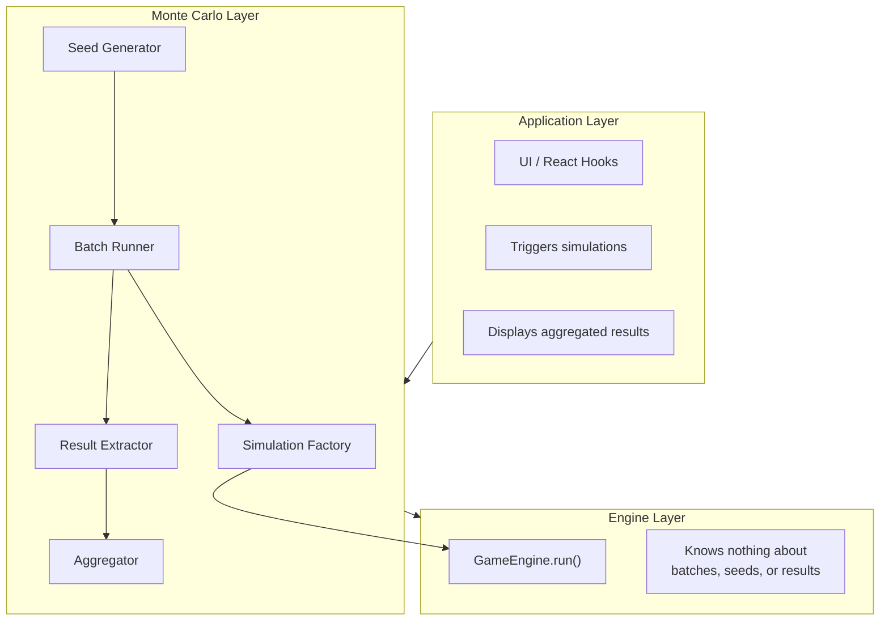
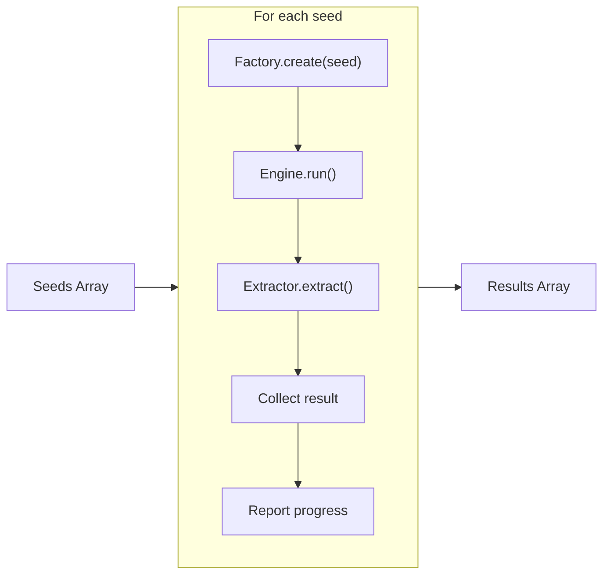

# 003-ADR: Result Tracking & Monte Carlo Analysis

**Date:** 2025-12-21
**Status:** Proposed

---

## Context

The simulation engine (`tiny-engine`) is game-agnostic and runs a single simulation to completion. However, the racing domain requires:

1. Running **N samples** (1 to 500+) for Monte Carlo analysis
2. **Deterministic seeding** for reproducible results
3. **Result collection** for statistical analysis

This ADR defines how seeding, result extraction, and aggregation work **outside** the engine layer.

> **Note:** Parallel execution via Web Workers is out of scope for this ADR and addressed in ADR-004.

---

## Goals

1. **Deterministic reproducibility**: Given the same seed, produce identical results
2. **Independent seed computation**: Any sample's seed can be computed without computing prior seeds
3. **Separation of concerns**: Keep Monte Carlo logic out of the engine layer
4. **Extensible result collection**: Support various analysis needs without modifying core components
5. **Statistical rigor**: Provide accurate aggregated statistics with confidence intervals

## Non-Goals

- Parallel execution (see ADR-004)
- Real-time visualization during simulation
- Backwards compatibility with sequential seed generation

---

## Design Overview

### Architectural Layers



---

## Core Components

### Component Responsibilities

| Component              | Responsibility                                                                 |
| ---------------------- | ------------------------------------------------------------------------------ |
| **Simulation Factory** | Creates a fresh, seeded simulation instance; encapsulates all setup logic      |
| **Result Extractor**   | Pulls structured data from entities/behaviors after simulation completes       |
| **Seed Generator**     | Produces deterministic seeds from a master seed using hash-based derivation    |
| **Batch Runner**       | Executes N simulations sequentially, collecting results                        |
| **Aggregator**         | Computes statistics (mean, std dev, percentiles, rates) from collected results |

---

### 1. Simulation Factory

The factory creates a new simulation instance for each sample.

**Inputs:**

- Seed (determines all RNG for this run)
- Configuration (course, race parameters, runner templates)

**Outputs:**

- Fully initialized `GameEngine` ready to run

**Behavior:**

1. Create a master RNG from the seed
2. Instantiate the `RaceSimulator` entity (global race state)
3. For each runner template, derive a sub-seed and create a `Runner` entity
4. Add all entities to the engine
5. Return the configured engine

The factory ensures each simulation is **isolated** and **deterministic** given its seed.

---

### 2. Simulation Result

Data extracted from a single completed simulation.

| Field                | Type                | Description                                |
| -------------------- | ------------------- | ------------------------------------------ |
| `seed`               | number              | The seed used (for reproducibility)        |
| `finishTimes`        | Map<RunnerId, Time> | Each runner's finish time                  |
| `winnerId`           | string              | Runner with lowest finish time             |
| `skillActivations`   | Array               | Skills that activated with timing/position |
| `positionKeepEvents` | Array               | Position keeping state changes             |
| `rushedEvents`       | Array               | Rushed (kakari) occurrences                |
| `finalHp`            | Map<RunnerId, HP>   | Remaining HP at finish                     |
| `positionTimeline`   | Array (optional)    | Full position history for visualization    |

**Skill Activation Record:**

| Field                | Description                      |
| -------------------- | -------------------------------- |
| `runnerId`           | Which runner activated the skill |
| `skillId`            | The skill identifier             |
| `activationPosition` | Distance at activation           |
| `activationTime`     | Time at activation               |
| `duration`           | How long the skill was active    |
| `effectValue`        | The modifier value applied       |

---

### 3. Result Extractor

Reads state from entities and behaviors after the race ends.

**Process:**

1. Iterate all `Runner` entities from the engine
2. Extract finish time from each runner's state
3. Query `SkillBehavior` for activation log
4. Query `PositionKeepBehavior` for event log
5. Query `RushedBehavior` for rushed events
6. Determine winner by sorting finish times
7. Return structured `SimulationResult`

The extractor is **read-only** and does not modify simulation state.

---

### 4. Seed Generation (Hash-Based)

Seeds are generated using hash-based derivation from a master seed.

**Algorithm:** MurmurHash-style mixing

**Properties:**

| Property             | Description                                               |
| -------------------- | --------------------------------------------------------- |
| **Deterministic**    | `seed(masterSeed, index)` always produces the same value  |
| **Independent**      | Any index can be computed without computing prior indices |
| **Well-distributed** | Output values spread evenly across 32-bit range           |
| **Fast**             | O(1) computation per seed                                 |

**Formula:**

```
h = masterSeed XOR index
h = h XOR (h >>> 16) * 0x85ebca6b
h = h XOR (h >>> 13) * 0xc2b2ae35
result = h XOR (h >>> 16)
```

**Example:**

- `generateSeed(12345, 0)` → always produces the same value
- `generateSeed(12345, 42)` → can be computed directly, no need to compute seeds 0-41

---

### 5. Batch Runner

Executes multiple simulations sequentially and collects results.

**Process:**



**Callbacks:**

| Callback           | When Called       | Payload            |
| ------------------ | ----------------- | ------------------ |
| `onProgress`       | After each sample | (completed, total) |
| `onSampleComplete` | After each sample | The result         |

---

### 6. Aggregator

Computes statistics from collected results.

**Output Statistics:**

| Statistic                   | Description                                            |
| --------------------------- | ------------------------------------------------------ |
| `sampleCount`               | Number of simulations run                              |
| `meanFinishTime`            | Average finish time                                    |
| `stdDevFinishTime`          | Standard deviation of finish times                     |
| `finishTimePercentiles`     | p5, p25, p50, p75, p95                                 |
| `winRate`                   | Fraction of runs where target runner won               |
| `winRateConfidenceInterval` | 95% CI for win rate                                    |
| `skillStats`                | Per-skill activation rate, mean position, effect value |
| `positionKeepFrequency`     | How often each PK state occurred                       |

**Implementation Considerations:**

| Concern                | Approach                                     |
| ---------------------- | -------------------------------------------- |
| Numerical stability    | Use Welford's algorithm for mean/variance    |
| Percentiles            | Sort-based for small N; t-digest for large N |
| Confidence intervals   | Normal approximation or bootstrap            |
| Skill value estimation | Compare finish times with/without activation |

---

## File Structure

```
racing/
├── monte-carlo/
│   ├── SimulationFactory.ts     # Creates seeded simulations
│   ├── ResultExtractor.ts       # Pulls data from completed runs
│   ├── Aggregator.ts            # Statistical analysis
│   ├── SeedGenerator.ts         # Hash-based seed derivation
│   ├── BatchRunner.ts           # Sequential execution
│   └── types.ts                 # SimulationResult, AggregatedStats
```

---

## Reproducibility

### Same Seed = Same Results

Given identical inputs (master seed, configuration), the system produces identical results across runs.

### Reproducing a Specific Sample

To reproduce sample #42 from a batch with master seed 12345:

1. Compute seed: `generateSeed(12345, 42)`
2. Create engine: `factory.create(computedSeed, config)`
3. Run simulation: `engine.run(maxDuration, dt)`
4. Results match sample #42 from the original batch

### Debugging Failed Samples

When a sample produces unexpected results:

1. Log the master seed and sample index
2. Reproduce the exact sample using the above method
3. Step through with debugger or detailed logging

---

## Alternatives Considered

### 1. Sequential Seed Generation (Current Approach)

Generate seeds by advancing a PRNG state sequentially.

**Pros**: Simple, standard approach
**Cons**: Cannot compute seed N without computing seeds 0 to N-1; complicates parallelism
**Decision**: Rejected in favor of hash-based derivation

### 2. Streaming Aggregation

Compute statistics incrementally as results arrive, without storing all results.

**Pros**: Constant memory regardless of N
**Cons**: Cannot compute percentiles exactly; more complex implementation
**Decision**: Deferred; batch aggregation sufficient for current N values

### 3. Result Caching

Store results to disk for later analysis.

**Pros**: Enables post-hoc analysis; avoids re-running simulations
**Cons**: Storage overhead; serialization complexity
**Decision**: Deferred; not needed for current use cases

---

## Consequences

### Positive

- **Engine stays minimal**: No Monte Carlo logic in `tiny-engine`
- **Testable in isolation**: Each component (factory, extractor, aggregator) can be unit tested
- **Fully reproducible**: Hash-based seeds allow reproducing any single run by index
- **Parallelization-ready**: Independent seeds enable future parallel execution (ADR-004)

### Negative

- **Memory pressure**: Storing all results before aggregation limits maximum N
- **Breaking change**: Hash-based seeds produce different results than sequential approach

### Mitigations

- For large N, implement streaming aggregation (deferred)
- Document seed strategy change clearly; no backwards compatibility

---

## Success Metrics

| Metric               | Target                                   | Measurement                  |
| -------------------- | ---------------------------------------- | ---------------------------- |
| Reproducibility      | 100% identical results for same seed     | Automated regression tests   |
| Seed computation     | O(1) per seed                            | No dependency on prior seeds |
| Memory usage         | <100MB for 500 samples                   | Profile peak memory          |
| Aggregation accuracy | <0.1% error vs. reference implementation | Statistical validation       |

---

## Open Questions

1. **Streaming aggregation**: Should we implement this now or defer until N exceeds memory limits?
2. **Result persistence**: Should we provide an option to save/load results for later analysis?
3. **Progressive UI updates**: Should the UI update after each sample or wait for completion?

---

## References

- ADR-002: Simulation Engine Architecture
- ADR-004: Parallel Execution with Web Workers
