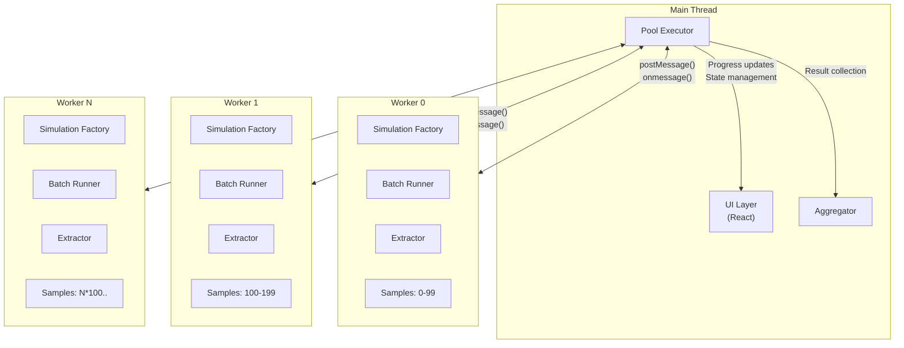
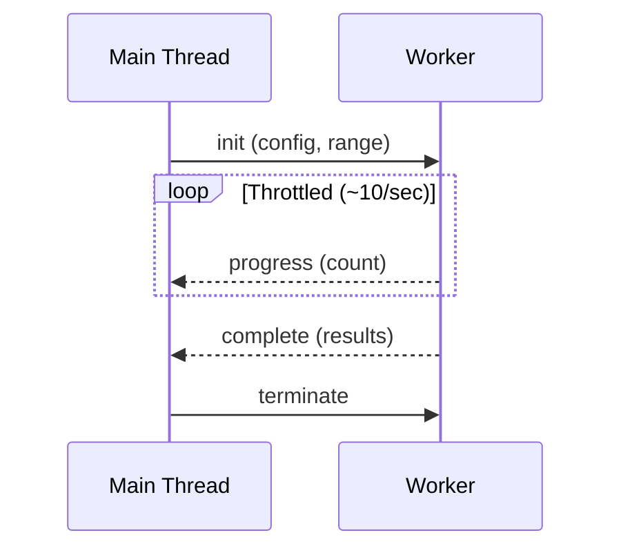

# 004-ADR: Parallel Execution with Web Workers

**Date:** 2025-12-21
**Status:** Proposed

---

## Context

ADR-003 establishes the Monte Carlo analysis layer for running N simulations with deterministic seeding. However, executing hundreds of simulations sequentially on the main thread causes:

- **UI blocking**: The browser becomes unresponsive during long-running simulations
- **Poor user experience**: No visual feedback or progress indication
- **Underutilized hardware**: Modern devices have multiple CPU cores sitting idle

This ADR addresses parallel execution of simulations using Web Workers while maintaining determinism and providing real-time progress feedback.

---

## Goals

1. **Non-blocking execution**: Keep the main thread responsive during simulation
2. **Parallel processing**: Utilize available CPU cores for faster throughput
3. **Real-time progress**: Provide meaningful progress updates to the UI
4. **Graceful degradation**: Handle worker failures without losing all results
5. **Reproducibility**: Maintain deterministic results regardless of parallelization

## Non-Goals

- SharedArrayBuffer usage (requires COOP/COEP headers, adds deployment complexity)
- GPU acceleration (out of scope)
- Distributed execution across machines
- Persistent worker processes between page loads

---

## Design Overview

### System Architecture



### Component Responsibilities

| Component             | Responsibility                                                         |
| --------------------- | ---------------------------------------------------------------------- |
| **Pool Executor**     | Creates workers, distributes work, collects results, manages lifecycle |
| **Worker**            | Runs assigned simulations using Monte Carlo components from ADR-003    |
| **Progress Reporter** | Throttles progress messages to avoid flooding main thread              |
| **Result Merger**     | Combines partial results from workers into unified result set          |
| **Aggregator**        | Computes statistics from merged results (runs on main thread)          |

---

## Work Distribution Strategy

### Seed Range Assignment

Rather than sending individual seeds to workers, assign each worker a **range** defined by:

- Master seed (from user input)
- Start index
- Count

Workers compute their own seeds using the hash-based derivation from ADR-003. This approach:

- Reduces message payload size (3 numbers vs. N numbers)
- Allows workers to operate independently
- Maintains determinism (same master seed + index = same result)

### Load Balancing

**Static partitioning** is used: divide total samples evenly across workers at the start.

Rationale:

- Simulations have consistent runtime (same game rules, similar race lengths)
- Avoids coordination overhead of dynamic work stealing
- Simpler implementation with predictable behavior

For highly variable workloads (not our case), dynamic work stealing could be considered.

---

## Communication Protocol

### Message Flow



### Message Types

**Main → Worker:**

| Message     | Payload                                 | Description            |
| ----------- | --------------------------------------- | ---------------------- |
| `run`       | Config, master seed, start index, count | Start simulation batch |
| `terminate` | —                                       | Graceful shutdown      |

**Worker → Main:**

| Message          | Payload         | Description              |
| ---------------- | --------------- | ------------------------ |
| `progress`       | Completed count | Periodic progress update |
| `batch-complete` | Results array   | All samples finished     |
| `error`          | Error message   | Unrecoverable failure    |

### Progress Throttling

Workers report progress at most every **100ms** to avoid:

- Message queue congestion
- Main thread saturation
- Unnecessary React re-renders

Accumulated counts are flushed on batch completion.

---

## Result Handling

### Serialization Requirements

Web Workers communicate via structured cloning. Certain types require conversion:

| Original Type   | Serialized As  | Notes                       |
| --------------- | -------------- | --------------------------- |
| `Map<K, V>`     | `Record<K, V>` | Convert to/from on boundary |
| `Set<T>`        | `T[]`          | Convert to/from on boundary |
| Functions       | —              | Not serializable; omit      |
| Class instances | Plain objects  | Lose prototype chain        |

A serialization layer converts between internal types and transfer types at the worker boundary.

### Result Merging

Results from workers arrive independently and must be merged:

1. Collect all `batch-complete` messages
2. Concatenate result arrays (order doesn't matter for aggregation)
3. Pass merged array to Aggregator

For ordered results (if needed), include the seed or index in each result for post-hoc sorting.

---

## Error Handling

### Failure Modes

| Failure           | Detection         | Recovery                                   |
| ----------------- | ----------------- | ------------------------------------------ |
| Worker crash      | `onerror` event   | Log error, continue with remaining workers |
| Script error      | `error` message   | Report to user, terminate worker           |
| Timeout           | Heartbeat timeout | Terminate and reallocate work (optional)   |
| Memory exhaustion | Worker crash      | Reduce pool size, retry                    |

### Graceful Degradation

If workers fail:

1. Mark failed workers as unavailable
2. Continue collecting results from healthy workers
3. Report partial results with warning if >50% workers fail
4. If all workers fail, fall back to single-threaded execution (optional)

### User Cancellation

Users can cancel a running simulation:

1. Pool executor calls `terminate()` on all workers
2. Workers receive `terminate` message and clean up
3. Partial results are discarded (or optionally returned)
4. UI resets to ready state

---

## Performance Characteristics

### Pool Sizing

| Cores Available | Recommended Pool Size | Rationale                         |
| --------------- | --------------------- | --------------------------------- |
| 2               | 2                     | Use both cores                    |
| 4               | 3-4                   | Leave 1 for main thread if needed |
| 8+              | 6-8                   | Diminishing returns beyond 8      |
| Unknown         | 4                     | Safe default                      |

Formula: `min(max(2, cores - 1), 8)`

---

## Integration Points

### With Monte Carlo Layer (ADR-003)

Workers use the same components defined in ADR-003:

- `SimulationFactory` creates seeded simulations
- `BatchRunner` executes samples sequentially within each worker
- `ResultExtractor` pulls data from completed simulations

The Pool Executor is an **alternative to** `BatchRunner` for parallel execution, not a replacement. Both implement the same conceptual interface.

### With UI Layer

The Pool Executor exposes callbacks for:

- **Progress**: `(completed, total) → void`
- **Completion**: `(results, metrics) → void`
- **Error**: `(error) → void`

React hooks wrap the Pool Executor to provide:

- State management (running, progress, results)
- Cleanup on unmount
- Cancellation support

---

## Alternatives Considered

### 1. Single Worker with Chunked Execution

Run all samples in one worker, yielding periodically.

**Pros**: Simpler, no result merging
**Cons**: No parallelism, limited speedup
**Decision**: Rejected; doesn't utilize available cores

### 2. Worker Pool with Dynamic Scheduling

Workers request work from a central queue.

**Pros**: Better load balancing for variable workloads
**Cons**: More complex, coordination overhead
**Decision**: Deferred; static partitioning sufficient for now

### 3. SharedArrayBuffer for Results

Write results directly to shared memory.

**Pros**: Zero-copy result transfer
**Cons**: Requires COOP/COEP headers, complex synchronization
**Decision**: Rejected; deployment complexity not worth it

---

## File Structure

```
racing/
├── execution/
│   ├── WorkerPoolExecutor.ts    # Pool management, work distribution
│   ├── ProgressReporter.ts      # Throttled progress updates
│   ├── ResultMerger.ts          # Combines worker results
│   └── types.ts                 # Callbacks, metrics, worker state
├── workers/
│   ├── simulation.worker.ts     # Worker entry point
│   └── serialization.ts         # Type conversions for transfer
```

---

## Success Metrics

| Metric            | Target              | Measurement              |
| ----------------- | ------------------- | ------------------------ |
| UI responsiveness | <16ms frame time    | Performance profiler     |
| Speedup (4 cores) | >3x vs. sequential  | Benchmark comparison     |
| Worker startup    | <50ms               | Timestamp first progress |
| Memory overhead   | <50MB for 8 workers | DevTools memory snapshot |

---

## Rollout Plan

1. **Phase 1**: Implement Pool Executor with static partitioning
2. **Phase 2**: Add progress throttling and UI integration
3. **Phase 3**: Add error handling and graceful degradation
4. **Phase 4**: Performance tuning and benchmarking

---

## Open Questions

1. **Worker reuse**: Should workers persist between simulation runs for faster subsequent runs?
2. **Adaptive sizing**: Should pool size adjust based on system load or battery status?
3. **Partial results**: On cancellation, should partial results be returned or discarded?

---

## References

- ADR-003: Result Tracking & Monte Carlo Analysis
- ADR-002: Simulation Engine Architecture
- Existing implementation: `src/workers/pool/pool-manager.ts`
- MDN Web Workers API documentation
