# 001-ADR: Detailed Stamina Calculations

## Overview

Restore and enhance the stamina calculator to use **detailed acceleration phases** with kinematic calculations. The simplified calculator assumes constant speed throughout each phase, but the accurate version will model:

1. **Start Dash acceleration** (`3` m/s → `0.85 * BaseSpeed`)
2. **Phase transition accelerations** (between each phase's target speed)
3. **Top-speed segments** (remaining distance at constant target speed)

This provides more accurate HP consumption estimates, especially for low-power builds where acceleration time is significant.---

## Global Server Half Anniversary Mechanics

The following mechanics are **included** (available on Global Server):

| Mechanic                                | Status | Notes                                                          |
| --------------------------------------- | ------ | -------------------------------------------------------------- |
| Base acceleration formula               | Yes    | `0.0006` m/s² (0.0004 uphill)                                  |
| Start dash +24 m/s²                     | Yes    | Ends at `0.85 * BaseSpeed`                                     |
| Guts component in last spurt            | Yes    | Added after 1st anniversary: `(450 * GutsStat)^0.597 × 0.0001` |
| Last spurt recalculation on HP recovery | Yes    | Added after 1st anniversary                                    |
| Deceleration by phase                   | Yes    | Early: `-1.2`, Mid: `-0.8`, Late: `-1.0` m/s²                  |
| Guts modifier for HP consumption        | Yes    | `1.0 + 200 / sqrt(600 * GutsStat)` in phase 2+                 |
| Strategy phase coefficients             | Yes    | For both speed and acceleration                                |
| Ground/Distance aptitude modifiers      | Yes    | For acceleration                                               |

The following mechanics are **NOT included** (post-Half Anniversary / JP-only):

| Mechanic                         | Status | Notes                                |
| -------------------------------- | ------ | ------------------------------------ |
| Pace Down mode -0.5 deceleration | No     | 1.5 anniversary feature              |
| Pace Up Ex mode                  | No     | 1.5 anniversary feature              |
| Conserve Power / Fully Charged   | No     | Post-Half Anniversary                |
| Compete Before Spurt             | No     | Post-Half Anniversary                |
| Stamina Limit Break              | No     | Post-Half Anniversary                |
| Move Lane modifier               | No     | Post-1st anniversary (not in Global) |

## Key Formulas (from docs/race-mechanics.md)

### Acceleration

```javascript
Accel = BaseAccel × sqrt(500 × PowerStat) × StrategyPhaseCoef ×
        GroundTypeProficiencyModifier × DistanceProficiencyModifier +
        SkillModifier + StartDashModifier
```

- **BaseAccel**: `0.0006` m/s² (0.0004 uphill)
- **Start Dash Modifier**: `+24.0` m/s² (ends when speed reaches `0.85 * BaseSpeed`)

### Kinematics During Acceleration

For constant acceleration from `v0` to `v1`:

- **Time**: `t = (v1 - v0) / accel`
- **Distance**: `d = v0 × t + 0.5 × accel × t²`
- **Average Speed**: `(v0 + v1) / 2`

### HP Consumption

HP is consumed based on current speed. During acceleration, we approximate using average speed over the acceleration period:

```javascript
HP = time × hpPerSecond(avgSpeed)
```

---

## Phase Structure

```mermaid
flowchart LR
    subgraph StartDash [Start Dash]
        SD["3.0 → 0.85×baseSpeed<br/>accel + 24 m/s²"]
    end

    subgraph Phase0 [Early-race Phase 0]
        P0A["Accel to phase0Speed"]
        P0T["Top speed at phase0Speed"]
    end

    subgraph Phase1 [Mid-race Phase 1]
        P1A["Accel to phase1Speed"]
        P1T["Top speed at phase1Speed"]
    end

    subgraph Phase2 [Late-race Phase 2]
        P2A["Accel to maxSpurtSpeed"]
        P2T["Top speed at maxSpurtSpeed"]
    end

    subgraph Phase3 [Last Spurt Phase 3]
        P3T["Top speed at maxSpurtSpeed"]
    end

    SD --> P0A --> P0T --> P1A --> P1T --> P2A --> P2T --> P3T
```



---

## Implementation Plan

### 1. Add Acceleration Utilities to SpurtCalculator

Add helper functions to [`src/modules/simulation/lib/SpurtCalculator.ts`](src/modules/simulation/lib/SpurtCalculator.ts). These will be reusable across the codebase:

```typescript
// Constants from docs/race-mechanics.md (Global Server)
export const BaseAccel = 0.0006; // m/s² (normal)
export const UphillBaseAccel = 0.0004; // m/s² (uphill)
export const StartDashAccel = 24.0; // m/s² (additional during start dash)
export const StartingSpeed = 3.0; // m/s

// Deceleration rates by phase (Global Server - no Pace Down mode)
export const DecelerationByPhase = Object.freeze([
  -1.2, // Phase 0: Early-race
  -0.8, // Phase 1: Mid-race
  -1.0, // Phase 2: Late-race
  -1.0, // Phase 3: Last Spurt
]);

// Strategy phase coefficients for ACCELERATION (different from speed!)
export const AccelerationStrategyPhaseCoef = Object.freeze([
  [], // strategies start at 1
  [1.0, 1.0, 0.996], // Nige (Front Runner)
  [0.985, 1.0, 0.996], // Senkou (Pace Chaser)
  [0.975, 1.0, 1.0], // Sashi (Late Surger)
  [0.945, 1.0, 0.997], // Oikomi (End Closer)
  [1.17, 0.94, 0.956], // Oonige (Runaway)
]);

// Ground type proficiency modifier for acceleration
export const AccelerationGroundTypeProficiency = Object.freeze([
  0,
  1.05,
  1.0,
  0.9,
  0.8,
  0.7,
  0.5,
  0.3,
  0.1, // _, S, A, B, C, D, E, F, G
]);

// Distance proficiency modifier for acceleration (different from speed!)
export const AccelerationDistanceProficiency = Object.freeze([
  0,
  1.0,
  1.0,
  1.0,
  1.0,
  1.0,
  0.6,
  0.5,
  0.4, // _, S, A, B, C, D, E, F, G
]);

/**
 * Calculate acceleration rate (Global Server formula)
 * Accel = BaseAccel × sqrt(500 × PowerStat) × StrategyPhaseCoef ×
 *         GroundTypeProficiencyModifier × DistanceProficiencyModifier + StartDashModifier
 */
export function calculateAcceleration(options: {
  power: number;
  strategy: number;
  phase: number;
  surfaceAptitude: number;
  distanceAptitude: number;
  isUphill?: boolean;
  isStartDash?: boolean;
}): number;

/**
 * Calculate kinematics for an acceleration segment
 * Returns time, distance, and average speed for HP calculation
 */
export function calculateAccelerationPhase(options: {
  startSpeed: number;
  goalSpeed: number;
  acceleration: number;
}): { time: number; distance: number; avgSpeed: number };

/**
 * Calculate start dash threshold speed (0.85 × baseSpeed)
 */
export function calculateStartDashThreshold(distance: number): number;
```

### 2. Update Calculator to Use Detailed Phases

Modify [`src/modules/stamina-calculator/lib/calculator.ts`](src/modules/stamina-calculator/lib/calculator.ts) to:

1. **Calculate phase boundaries** (same as before):

- Phase 0: 0 → distance/6
- Phase 1: distance/6 → distance×2/3
- Phase 2: distance×2/3 → distance×5/6
- Phase 3: distance×5/6 → distance - 60m buffer

2. **Build detailed phase breakdown array**:

- Start Dash: 3.0 m/s → 0.85×baseSpeed (special accel with +24 m/s²)
- Early Accel: 0.85×baseSpeed → phase0Speed
- Early Top: remaining Phase 0 distance at phase0Speed
- Mid Accel: phase0Speed → phase1Speed (only if phase1Speed > phase0Speed)
- Mid Top: remaining Phase 1 distance at phase1Speed
- Late Accel: phase1Speed → maxSpurtSpeed
- Late Top: remaining Phase 2 distance at maxSpurtSpeed
- Last Spurt: Phase 3 distance at maxSpurtSpeed

3. **For each segment**, calculate:

- Time (kinematic or distance/speed)
- Distance
- HP consumption (time × hpPerSecond at average speed)

4. **Handle deceleration cases**: If goalSpeed < startSpeed, the uma decelerates instead of accelerates (uses deceleration rates from docs)

### 3. Update PhaseBreakdownRow Type

The existing type in [`src/modules/stamina-calculator/types.ts`](src/modules/stamina-calculator/types.ts) already supports this:

```typescript
export interface PhaseBreakdownRow {
  phaseName: string;
  startSpeed: number;
  goalSpeed: number;
  acceleration: number;
  timeSeconds: number;
  distanceMeters: number;
  hpConsumption: number;
}
```

### 4. Update Phase Table Component

Modify [`src/modules/stamina-calculator/components/phase-table.tsx`](src/modules/stamina-calculator/components/phase-table.tsx) to display more rows with the detailed breakdown.

## Edge Cases to Handle

1. **Negative acceleration distance**: If calculated acceleration distance exceeds phase distance, clamp to phase distance and adjust calculations
2. **Deceleration**: When target speed decreases (e.g., Front Runner mid-race), use deceleration rates (-0.8 to -1.2 m/s² based on phase)
3. **Start dash on uphill**: Base accel is 0.0004 instead of 0.0006
4. **Minimum speed enforcement**: After start dash, speed is raised to minimum if below

---

## Expected Output

The phase table will show ~8-10 rows instead of 4, like:

| Phase       | Start Speed | Goal Speed | Accel | Time   | Distance | HP    |
| ----------- | ----------- | ---------- | ----- | ------ | -------- | ----- |
| Start Dash  | 3.00        | 16.66      | 24.84 | 0.55s  | 5.4m     | 8.2   |
| Early Accel | 16.66       | 19.56      | 0.84  | 3.45s  | 62.5m    | 98.1  |
| Early Top   | 19.56       | 19.56      | 0     | 16.98s | 332.1m   | 530.5 |
