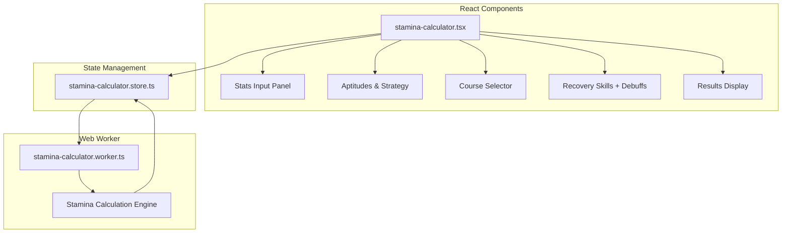

# 002-ADR: Standalone Stamina Calculator

Build a dedicated stamina calculator page that analyzes whether an uma can complete a race at maximum spurt speed, accounting for stats, aptitudes, recovery skills, stamina drain debuffs, and race conditions.

## Architecture Overview



## Module Structure

All new files live in the `src/modules/stamina-calculator/` module:

```javascript
src/modules/stamina-calculator/
├── components/
│   ├── stats-panel.tsx           # Speed, Stamina, Power, Guts, Wisdom inputs
│   ├── aptitudes-panel.tsx       # Aptitudes, Strategy, Mood selectors
│   ├── course-panel.tsx          # Course selector with ground condition
│   ├── skills-panel.tsx          # Recovery skills + stamina drain debuffs picker
│   ├── results-panel.tsx         # Summary results (can max spurt, stamina needed, etc.)
│   └── phase-table.tsx           # Detailed phase breakdown table
├── hooks/
│   └── use-stamina-calculator.ts # Worker communication hook
├── store/
│   └── stamina-calculator.store.ts
├── lib/
│   └── calculator.ts             # Pure calculation functions (used by worker)
├── types.ts                      # Type definitions
└── index.ts                      # Module exports
```

## Key Files to Create/Modify

### New Files in Module

| File                                                               | Purpose                                              |
| ------------------------------------------------------------------ | ---------------------------------------------------- |
| `src/modules/stamina-calculator/types.ts`                          | Calculator input/output types, phase breakdown types |
| `src/modules/stamina-calculator/store/stamina-calculator.store.ts` | Zustand store for all calculator state               |
| `src/modules/stamina-calculator/lib/calculator.ts`                 | Pure calculation engine (shared with worker)         |
| `src/modules/stamina-calculator/hooks/use-stamina-calculator.ts`   | Worker management hook                               |
| `src/modules/stamina-calculator/components/stats-panel.tsx`        | Stats input UI                                       |
| `src/modules/stamina-calculator/components/aptitudes-panel.tsx`    | Aptitude/strategy/mood UI                            |
| `src/modules/stamina-calculator/components/course-panel.tsx`       | Course selection UI                                  |
| `src/modules/stamina-calculator/components/skills-panel.tsx`       | Recovery skills + drain debuffs UI                   |
| `src/modules/stamina-calculator/components/results-panel.tsx`      | Results summary UI                                   |
| `src/modules/stamina-calculator/components/phase-table.tsx`        | Phase breakdown table UI                             |
| `src/workers/stamina-calculator.worker.ts`                         | Web worker entry point                               |
| `src/routes/stamina-calculator.tsx`                                | Route page composing module components               |

### Reusable Components (import from existing modules)

- `src/modules/runners/components/StatInput.tsx` - Stat number inputs
- `src/modules/runners/components/AptitudeSelect.tsx` - Aptitude dropdowns
- `src/modules/runners/components/StrategySelect.tsx` - Strategy selector
- `src/modules/runners/components/MoodSelect.tsx` - Mood selector
- `src/modules/racetrack/components/track-select.tsx` - Course picker
- `src/modules/skills/components/skill-list/SkillPickerDrawer.tsx` - Skill selection

### Existing Calculation Logic to Leverage

- `src/modules/simulation/tabs/stamina/hooks/useStaminaAnalysis.ts` - Core stamina formulas
- `src/modules/simulation/lib/SpurtCalculator.ts` - Spurt calculation utilities
- `src/modules/simulation/lib/HpPolicy.ts` - HP consumption constants

## Skill Support

### Recovery Skills (HP+)

- Green stamina skills that activate at gate
- HP recovery skills (1.5%, 3.5%, 5.5% tiers + unique levels)
- Consider skill proc rate option (wisdom-based activation chance)

### Stamina Drain Debuffs (HP-)

- Skills that drain opponent HP
- Debuff effects with negative HP values
- Display net HP effect (recovery - drain)

## Calculation Outputs (matching spreadsheet)

1. **Adjusted Stats** - Stats after motivation/ground modifiers
2. **Stamina Needed** - Minimum stamina for max spurt
3. **Sufficiency Status** - "You have enough!" or deficit amount
4. **Skill Proc Rate** - `max(100 - 9000/BaseWit, 20)%`
5. **Rushing Rate** - `(6.5 / log10(0.1 * WitStat + 1))^2 %`
6. **HP Recovery** - Total from recovery skills
7. **HP Drain** - Total from debuffs received
8. **Net HP Effect** - Recovery - Drain
9. **Phase Breakdown Table**:

- Start Dash, Early (Accel), Early (Top), Mid (Accel), Mid (Top), End (Accel), End (Top), Spurt (Accel), Spurt (Top), Post-HP0 (if applicable)
- Columns: Start Speed, Goal Speed, Acceleration, Time (s), Distance (m), HP Consumption

## Implementation Approach

- Use existing `calculateStaminaAnalysis()` as the base, extend with detailed phase breakdown
- Worker receives runner state + course + ground condition + skills, returns full analysis
- Store manages input state and calculation results
- UI provides responsive layout with collapsible sections
- Support both recovery skills AND stamina drain debuffs in skill selection
