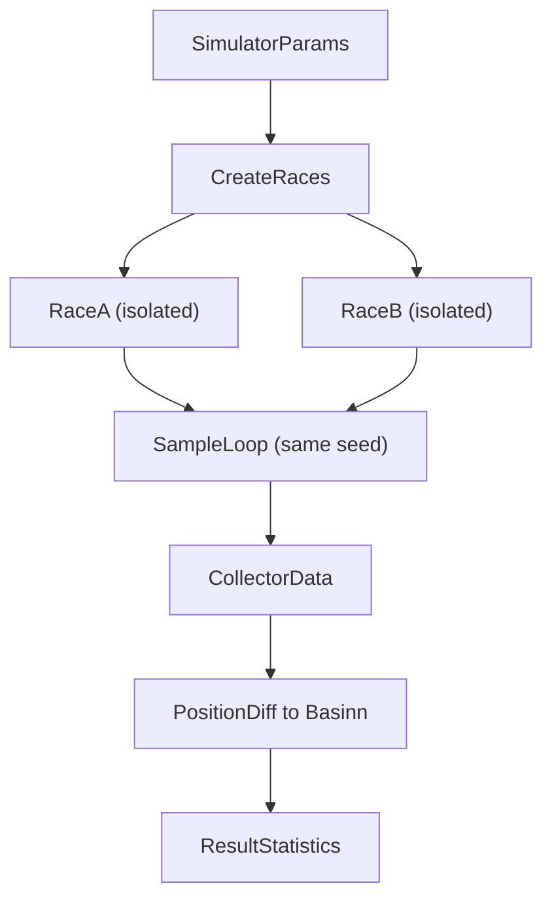

# Simulator Patterns

## Core Concept

All current simulators are comparison tools, not true race simulations.

They run two independent, isolated `Race` instances in `compare` mode with the same seed, then measure the end-of-race position delta as basinn (horse lengths). The runners do not share a race instance and do not interact with each other.

A true multi-runner race simulation is a planned future feature and would use `normal` mode with inter-runner interactions.

## Architecture Overview

## Simulator Families

### Full Compare Family

Reference: `src/modules/simulation/simulators/vacuum-compare.ts`

- Purpose: compare two full runner builds under configured mechanics.
- Settings: per-runner `createCompareSettings()` overrides from options.
- Collectors: `VacuumCompareDataCollector` on both race instances.
- Run data: full `SimulationRun` snapshots.
- Extra stats: rushed, lead competition, stamina, first UMA.
- Return type: `CompareResult`.

Use this family when comparing complete builds or configuration profiles.

### Skill Gain Family

Reference: `src/modules/simulation/simulators/skill-compare.ts`

- Purpose: measure isolated basinn gain from adding skills.
- Settings: `createCompareSettings()` defaults (all optional mechanics disabled).
- Collectors: baseline `VacuumCompareDataCollector`, with-skill `SkillCompareDataCollector`.
- Run data: `SkillSimulationRun` (tracked skill logs only).
- Extra stats: none (rushed/stamina/spot struggle/first UMA intentionally omitted).
- Return type: `SkillComparisonResult`.
- Batch entry point: `runSampling()` loops skill IDs and compares base vs base+skill.

Use this family when the goal is skill value isolation, not full-race behavior analysis.

### Skill Planner Family

Reference: `src/modules/simulation/simulators/skill-planner-compare.ts`

- Purpose: evaluate basinn gain for candidate skill combinations in optimizer runs.
- Settings: `createCompareSettings()` defaults (all optional mechanics disabled).
- Runner mapping:
  - `runnerA` (uma1): obtained skills only (baseline)
  - `runnerB` (uma2): obtained skills + candidate combination
- Collectors: baseline `BassinCollector` (position-only), with-candidates `SkillCompareDataCollector`.
- Run data: baseline tracks position per tick for `computePositionDiff`; planner consumes aggregate basinn stats.
- Return shape: sorted `results` with `min`/`max`/`mean`/`median` summary for optimization stages.

Use this family for optimization workflows where the baseline runner is only a finish-position reference.

## Building a New Simulator

1. Choose simulator family first (full compare vs skill gain).
2. Define request/response types in `src/modules/simulation/types.ts` and `src/modules/simulation/compare.types.ts`.
3. Build the simulator under `src/modules/simulation/simulators/`.
4. Reuse shared adapters from `src/modules/simulation/simulators/shared.ts`:
   - `toSundayRaceParameters`
   - `createCompareSettings`
   - `createInitializedRace`
   - `toCreateRunner`
   - `createSkillSorterByGroup`
   - `computePositionDiff`
5. Follow the sample loop pattern:
   - derive `sampleSeed = baseSeed + i`
   - `prepareRound(sampleSeed)` on both races
   - `run()` both races
   - collect runner snapshots
   - compute basinn
6. Track representative runs (min/max/mean/median) using sample cutoff:
   - `max(floor(nsamples * 0.8), nsamples - 200)`
7. Sort results and return the expected response shape.
8. Add deterministic tests in `src/modules/simulation/simulators/simulators.test.ts`.

## Shared Infrastructure

- `src/modules/simulation/simulators/shared.ts`: race setup adapters and comparison helpers.
- `src/lib/sunday-tools/common/race-observer.ts`: data collectors used by compare simulators.
- `src/modules/simulation/compare.types.ts`: run snapshot and skill activation types.

## Conventions

- Use strict equality (`===`) in simulator logic.
- Keep standalone math/stat calculators in `src/modules/simulation/calculators/`.
- Keep simulator modules focused on race orchestration and result shaping.
- Ensure deterministic outputs for a given seed.
