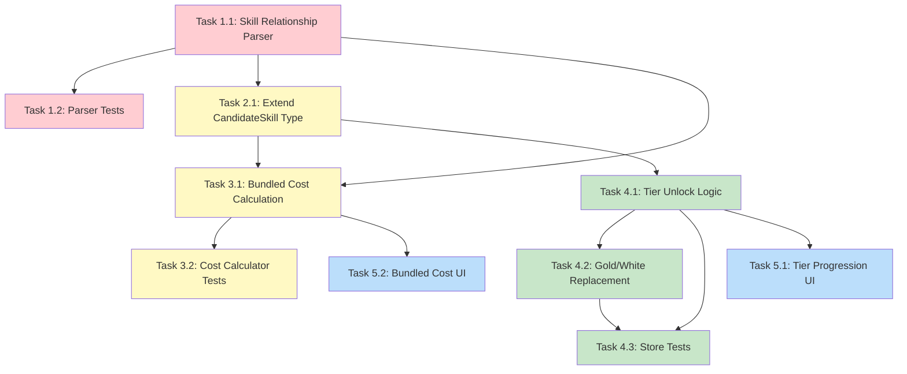

# Feature Breakdown: Skill Acquisition Mechanics

## Feature Definition

### Scope and User Value

Enable the skill planner to accurately model how skills are acquired in Umamusume: Pretty Derby's career mode, including:

- **Stackable skills** with tier progression (○ → ◎)
- **White/Gold skill relationships** with auto-bundling and dynamic cost calculation
- **Accurate cost display** based on which skills are already obtained

### User Value

Players can accurately plan their skill point budget by understanding the true cost of skills, including bundled purchases and tier upgrades, leading to better career optimization decisions.

### Affected Components/Files

| File                                             | Changes                                                                        |
| ------------------------------------------------ | ------------------------------------------------------------------------------ |
| `src/modules/skill-planner/types.ts`             | Extend `CandidateSkill` type with stackable and gold/white relationship fields |
| `src/modules/skill-planner/cost-calculator.ts`   | Add bundled cost calculation logic                                             |
| `src/modules/skill-planner/skill-planner.store.ts` | Update actions for tier management and replacement logic                     |
| `src/modules/skills/`                            | New skill relationship parser utility                                          |
| `src/modules/skill-planner/components/`          | UI updates for tier progression and bundled skills                             |

---

## User Story

**As a** skill planner user,
**I want** the planner to understand stackable skills and white/gold relationships,
**So that** I can see accurate costs and make informed decisions about which skills to buy within my budget.

### Acceptance Criteria

- [ ] Stackable skills (○/◎) are correctly identified and linked
- [ ] Buying base tier (○) shows the upgrade tier (◎) as available
- [ ] Gold skills display bundled cost when white skill not obtained
- [ ] Gold skills display reduced cost when white skill is obtained
- [ ] Buying a gold skill automatically marks related white skill as obtained
- [ ] Runner only shows the highest tier / gold version (replacement behavior)
- [ ] Cost calculations include hint level discounts for both white and gold portions

---

## Implementation Tasks

### Epic 1: Skill Relationship Data Layer

#### Task 1.1: Create Skill Relationship Parser

**Priority**: Critical
**Effort**: 1 day

**Description**: Create a utility to parse the `versions` field from GameTora skills data and build skill family maps.

**Technical Guidance**:

- Create new file: `src/modules/skills/skill-relationships.ts`
- Parse `versions` array to group related skills
- Detect stackable skills (multiple rarity=1 in same group)
- Detect gold skills (rarity=2 in versions group)
- Sort by cost to determine tier order (lowest = base)
- Export lookup functions:
  - `getSkillFamily(skillId)` → returns all related skill IDs
  - `isStackableSkill(skillId)` → boolean
  - `getGoldVersion(whiteSkillId)` → skillId or undefined
  - `getWhiteVersion(goldSkillId)` → skillId or undefined
  - `getBaseTier(skillId)` → skillId of base tier
  - `getUpgradeTier(skillId)` → skillId of upgrade tier or undefined

**Files**:

- `src/modules/skills/skill-relationships.ts` (new)
- `src/modules/data/gametora/skills.json` (read-only reference)

---

#### Task 1.2: Add Unit Tests for Skill Relationship Parser

**Priority**: Critical
**Effort**: 0.5 day
**Blocks**: Task 1.1

**Description**: Write comprehensive tests for the relationship parser using known skill families.

**Technical Guidance**:

- Test with Right-Handed family (200011, 200012, 200014)
- Test with Fall Runner family (stackable + gold)
- Test with non-stackable skills
- Test with skills that have no gold version
- Test edge cases (missing versions field, empty arrays)

**Files**:

- `src/modules/skills/__tests__/skill-relationships.test.ts` (new)

---

### Epic 2: Type System Updates

#### Task 2.1: Extend CandidateSkill Type

**Priority**: High
**Effort**: 0.5 day
**Related to**: Task 1.1

**Description**: Add new fields to `CandidateSkill` for stackable and gold/white relationship support.

**Technical Guidance**:

- Add fields per the documented specification:

```typescript
// Stackable support
isStackable: boolean;
tierLevel?: 1 | 2; // 1=base (○), 2=upgrade (◎)
nextTierId?: string;
previousTierId?: string;

// Gold/White relationship
isGold: boolean;
whiteSkillId?: string;
goldSkillId?: string;
baseTierIdForGold?: string;

// Cost calculation
displayCost?: number; // May differ from effectiveCost for bundled skills
```

- Update `createCandidate()` function to populate new fields using relationship parser

**Files**:

- `src/modules/skill-planner/types.ts`
- `src/modules/skill-planner/skill-planner.store.ts`

---

### Epic 3: Enhanced Cost Calculator

#### Task 3.1: Add Bundled Cost Calculation

**Priority**: High
**Effort**: 1 day
**Blocks**: Task 1.1, Task 2.1

**Description**: Extend cost calculator to handle gold skill bundled costs based on white skill obtained status.

**Technical Guidance**:

- Add function: `calculateDisplayCost(skillId, candidates, hasFastLearner)`
- For gold skills:
  - If white skill not in candidates or not obtained: return goldCost + whiteCost
  - If white skill obtained: return goldCost only
- Apply hint level discounts to both portions separately
- Apply Fast Learner to final total

**Files**:

- `src/modules/skill-planner/cost-calculator.ts`

---

#### Task 3.2: Add Bundled Cost Tests

**Priority**: High
**Effort**: 0.5 day
**Blocks**: Task 3.1

**Description**: Write tests for bundled cost calculation scenarios.

**Test Cases**:

- Gold skill with white not obtained → bundled cost
- Gold skill with white obtained → gold cost only
- Gold skill with stackable white (both tiers) → uses base tier cost
- Hint levels applied correctly to each portion
- Fast Learner applied to final total

**Files**:

- `src/modules/skill-planner/__tests__/cost-calculator.test.ts`

---

### Epic 4: Store Updates

#### Task 4.1: Add Tier Unlock Logic

**Priority**: Medium
**Effort**: 1 day
**Blocks**: Task 2.1

**Description**: Update store to track which tiers are unlocked and visible.

**Technical Guidance**:

- When adding a stackable candidate, only add base tier initially
- When base tier is marked as obtained, add upgrade tier to candidates
- `removeCandidate()` should also remove related tiers
- Add helper: `getVisibleCandidates()` → filters to show only purchasable skills

**Files**:

- `src/modules/skill-planner/skill-planner.store.ts`

---

#### Task 4.2: Add Gold/White Replacement Logic

**Priority**: Medium
**Effort**: 1 day
**Blocks**: Task 4.1

**Description**: Implement replacement behavior when buying gold skills.

**Technical Guidance**:

- When gold skill is marked as obtained:
  - Automatically mark base white tier as obtained
  - Remove all white tiers from runner's active skills
  - Only gold skill remains active
- Add action: `buyGoldSkill(goldSkillId)` that handles the full transaction
- Update `setCandidateObtained()` to trigger replacement logic

**Files**:

- `src/modules/skill-planner/skill-planner.store.ts`

---

#### Task 4.3: Add Store Tests for New Logic

**Priority**: Medium
**Effort**: 0.5 day
**Blocks**: Task 4.1, Task 4.2

**Description**: Write tests for tier unlock and replacement logic.

**Test Cases**:

- Adding stackable skill only adds base tier
- Marking base tier obtained unlocks upgrade tier
- Buying gold skill auto-obtains white skill
- Buying gold skill removes white from runner
- Removing candidate removes all related tiers

**Files**:

- `src/modules/skill-planner/__tests__/store.test.ts`

---

### Epic 5: UI Components

#### Task 5.1: Display Tier Progression in Skill List

**Priority**: Low
**Effort**: 1 day
**Blocks**: Task 4.1

**Description**: Update skill candidate list to show tier progression visually.

**Technical Guidance**:

- Show tier indicator (○/◎) next to skill name
- Gray out locked tiers
- Show "Unlock next tier" indicator when base is purchased
- Consider grouping related tiers visually

**Files**:

- `src/modules/skill-planner/components/CandidateSkillList.tsx`

---

#### Task 5.2: Display Bundled Cost for Gold Skills

**Priority**: Low
**Effort**: 0.5 day
**Blocks**: Task 3.1

**Description**: Show bundled cost breakdown for gold skills in the UI.

**Technical Guidance**:

- When displaying gold skill cost, show breakdown: "200 (110 + 90)"
- Indicate which white skill is included
- Show reduced cost when white is already obtained

**Files**:

- `src/modules/skill-planner/components/CandidateSkillList.tsx`

---

## Dependency Graph



---

## Summary

| Epic               | Tasks        | Total Effort | Priority |
| ------------------ | ------------ | ------------ | -------- |
| 1. Data Layer      | 1.1, 1.2     | 1.5 days     | Critical |
| 2. Type System     | 2.1          | 0.5 days     | High     |
| 3. Cost Calculator | 3.1, 3.2     | 1.5 days     | High     |
| 4. Store Updates   | 4.1, 4.2, 4.3 | 2.5 days    | Medium   |
| 5. UI Components   | 5.1, 5.2     | 1.5 days     | Low      |

**Total Estimated Effort**: ~7.5 days

---

## Out of Scope

The following items are documented but not included in this feature breakdown:

- × self-debuff tier handling (removed for simplicity)
- Evolution skills (rarity=6)
- Unique skills (rarity 3-5)
- Optimization algorithm updates to consider tier dependencies
- Skill recommendation based on unlockable tiers

---

## Reference Documentation

- [Skill Planner Module README](../../src/modules/skill-planner/README.md) - Full specification of skill acquisition mechanics

