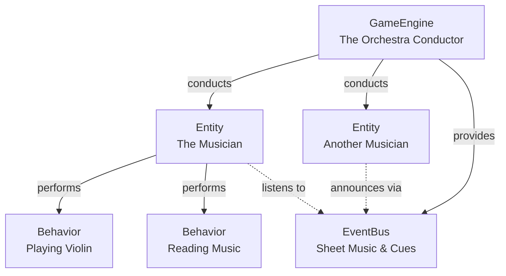
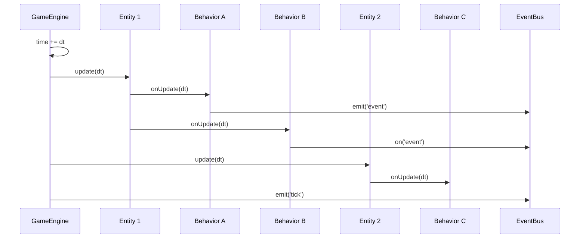

# Core Concepts

Tiny Engine is built on four simple but powerful concepts. Let's explore each one.

## The Four Pillars



## GameEngine: The Conductor

The `GameEngine` is your simulation's main loop. It:
- Manages all entities
- Advances time each tick
- Provides the shared event bus

Think of it as an orchestra conductor—it doesn't make music itself, but it coordinates everyone else.

```typescript
const engine = new GameEngine();

// Add your "musicians"
engine.addEntity(runner1);
engine.addEntity(runner2);

// Start the "performance"
engine.run(raceTime, 0.0666); // Run at 15 fps
```

**Key insight**: The engine knows nothing about your domain. It doesn't know what a "runner" is or what "stamina" means. It just ticks forward and updates entities.

## Entity: The Identity

An `Entity` is a container with an ID. It holds behaviors and provides them with identity and context.

```typescript
const runner = new Entity('runner-1');
const raceSimulator = new Entity('race-simulator');
```

Entities are like actors in your simulation. Each has:
- A unique `id`
- A collection of `behaviors`
- A reference to the `engine` (when added)

**Think of it like this**: In a racing game, each horse is an entity. The race itself could also be an entity (managing phases, weather, etc.).

```typescript
// Horse entity
const silenceSuzuka = new Entity('silence-suzuka');
silenceSuzuka.addBehavior(new MovementBehavior());
silenceSuzuka.addBehavior(new StaminaBehavior());
silenceSuzuka.addBehavior(new SkillBehavior());

// Race orchestrator entity
const raceOrchestrator = new Entity('race-orchestrator');
raceOrchestrator.addBehavior(new PhaseTransitionBehavior());
raceOrchestrator.addBehavior(new WeatherBehavior());
```

## Behavior: The Worker

A `Behavior` is a piece of logic that does one thing well. It has three lifecycle hooks:

```typescript
class MyBehavior extends Behavior {
  // Called when attached to an entity
  override onAttach(owner: Entity): void {
    super.onAttach(owner);
    console.log('Attached to', owner.id);
  }

  // Called every tick
  override onUpdate(dt: number): void {
    // This is where the magic happens
  }

  // Called when removed from entity
  override onDetach(): void {
    super.onDetach();
    console.log('Cleanup time');
  }
}
```

### Behaviors Are Focused

Each behavior should do **one thing**:

```typescript
// ✅ Good: Focused behaviors
class MovementBehavior extends Behavior {
  // Handles position and velocity
}

class StaminaBehavior extends Behavior {
  // Handles HP consumption and recovery
}

class SkillBehavior extends Behavior {
  // Handles skill activation and effects
}

// ❌ Bad: God-object behavior
class RaceBehavior extends Behavior {
  // Handles movement AND stamina AND skills AND AI...
}
```

### Behaviors Communicate

Behaviors can talk to each other in two ways:

**1. Direct access** (same entity):

```typescript
class StaminaBehavior extends Behavior {
  override onUpdate(dt: number): void {
    // Get movement behavior from same entity
    const movement = this.owner?.getBehavior(MovementBehavior);
    if (movement) {
      // Consume stamina based on speed
      this.hp -= movement.currentSpeed * dt;
    }
  }
}
```

**2. Events** (any entity):

```typescript
class SkillBehavior extends Behavior {
  override onUpdate(): void {
    if (this.skillReady) {
      // Notify everyone about skill activation
      this.owner?.engine?.eventBus.emit('skill:activated', {
        runnerId: this.owner!.id,
        skillId: 'speed-boost',
      });
    }
  }
}
```

### Priority Matters

Behaviors execute in priority order (lower numbers first):

```typescript
class MovementBehavior extends Behavior {
  priority = 0; // Calculate position FIRST

  override onUpdate(dt: number): void {
    this.position += this.velocity * dt;
  }
}

class CollisionBehavior extends Behavior {
  priority = 10; // Check collisions AFTER movement

  override onUpdate(dt: number): void {
    const movement = this.owner?.getBehavior(MovementBehavior);
    // Check if new position causes collision
  }
}
```

## EventBus: The Communication Layer

The `EventBus` lets behaviors communicate without knowing about each other:

```typescript
// Publisher (doesn't know who's listening)
class ProducerBehavior extends Behavior {
  override onUpdate(): void {
    this.owner?.engine?.eventBus.emit('data:ready', { value: 42 });
  }
}

// Subscriber (doesn't know who sent it)
class ConsumerBehavior extends Behavior {
  override onUpdate(): void {
    if (!this.subscribed && this.owner?.engine) {
      this.owner.engine.eventBus.on('data:ready', (data) => {
        console.log('Received:', data.value);
      });
      this.subscribed = true;
    }
  }
}
```

This is **crucial** for complex systems. In a racing simulator:
- Skills emit debuff events
- Other runners listen for those debuffs
- Phase changes notify all behaviors
- No tight coupling!

## How They Work Together

Let's see all four concepts in action:

```typescript
// 1. Create the engine (conductor)
const engine = new GameEngine();

// 2. Create entities (actors)
const player = new Entity('player');
const enemy = new Entity('enemy');

// 3. Add behaviors (actions)
player.addBehavior(new HealthBehavior());
player.addBehavior(new MovementBehavior());
enemy.addBehavior(new HealthBehavior());
enemy.addBehavior(new AIBehavior());

// 4. Connect them to engine
engine.addEntity(player);
engine.addEntity(enemy);

// 5. Use events for communication
engine.eventBus.on('entity:damaged', (data) => {
  console.log(`${data.entityId} took ${data.damage} damage!`);
});

// 6. Run the simulation
engine.run(10.0, 0.016); // 10 seconds at 60fps
```

## Execution Flow

Here's what happens each tick:



Notice:
- **Entities update in order** (insertion order, deterministic)
- **Behaviors update by priority** (within each entity)
- **Events fire synchronously** (no async surprises)

## A Simple Metaphor

If Tiny Engine was a restaurant:

- **GameEngine** = The kitchen timer (tick, tick, tick)
- **Entity** = A chef (has an identity and job)
- **Behavior** = A task (chopping, stirring, plating)
- **EventBus** = The order ticket system (communication between stations)

When the timer ticks, each chef performs their tasks in order. They communicate via tickets ("order up!", "need more onions!") without shouting across the kitchen.

## Core Principles

### 1. Game-Agnostic

The engine doesn't know about your domain. There's no built-in concept of "health" or "position" or "racing." You define those in your behaviors.

### 2. Deterministic

Same inputs → same outputs, always. No hidden state, no wall-clock time, no `Math.random()`. If you need randomness, you provide a seeded RNG.

### 3. Explicit Everything

- Time doesn't advance magically—you call `tick(dt)`
- Entities don't auto-update—engine calls their `update()`
- Events don't self-clean—you manage subscriptions

This explicitness makes debugging easy and behavior predictable.

## What's Next?

Now that you understand the four pillars, let's build something! Head to [Your First Simulation](03-your-first-simulation.md) to create a working simulation from scratch.

Want to dive deeper into any concept first?
- [Behaviors in depth](04-behaviors.md)
- [Event-driven architecture](05-events.md)
- [Advanced patterns](06-advanced-patterns.md)

