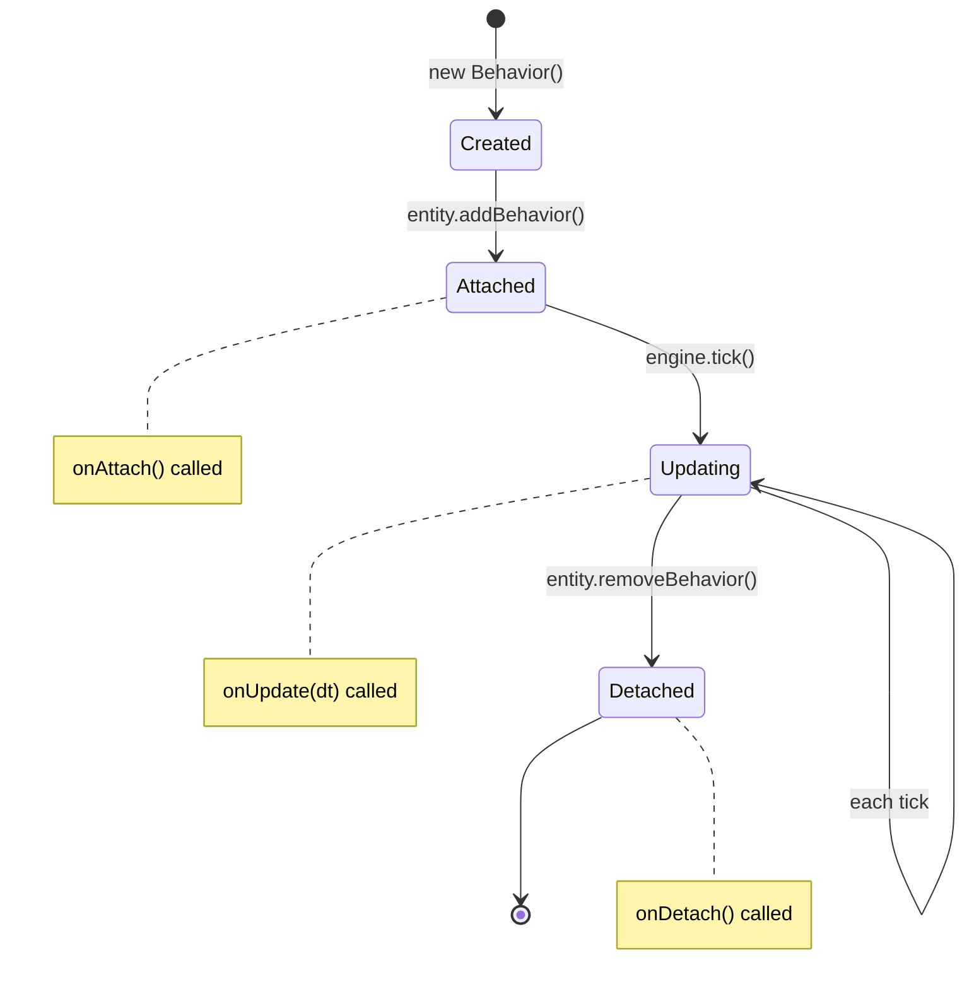

# Behaviors

Behaviors are where your simulation logic lives. Let's master them.

## The Behavior Lifecycle

Every behavior has three lifecycle hooks. Understanding when each runs is crucial:



### onAttach: Setup

Called once when the behavior is added to an entity:

```typescript
class HealthBehavior extends Behavior {
  maxHp = 100;
  currentHp = 100;

  override onAttach(owner: Entity): void {
    super.onAttach(owner); // Always call super!

    console.log(`Health system initialized for ${owner.id}`);
    // Good place for one-time setup
  }
}
```

**Warning**: Don't access `this.owner.engine` here—it's not set yet! The entity might not be in an engine when the behavior is attached.

### onUpdate: The Main Loop

Called every tick. This is where the action happens:

```typescript
class MovementBehavior extends Behavior {
  position = 0;
  velocity = 10;

  override onUpdate(dt: number): void {
    // Update position each tick
    this.position += this.velocity * dt;

    // Check boundary
    if (this.position > 100) {
      this.position = 100;
      this.velocity = 0;
    }
  }
}
```

**The `dt` parameter** is the time elapsed since the last tick. Always use it for time-based calculations to maintain frame-rate independence.

### onDetach: Cleanup

Called when the behavior is removed from an entity:

```typescript
class EventListenerBehavior extends Behavior {
  private handler = (data: any) => { /* ... */ };

  override onUpdate(): void {
    if (!this.subscribed && this.owner?.engine) {
      this.owner.engine.eventBus.on('update', this.handler);
      this.subscribed = true;
    }
  }

  override onDetach(): void {
    // Clean up event listeners
    if (this.owner?.engine) {
      this.owner.engine.eventBus.off('update', this.handler);
    }
    super.onDetach();
  }
}
```

**Good practice**: Always clean up resources (event listeners, timers, etc.) in `onDetach`.

## Priority: Execution Order

Behaviors execute in priority order (lower first). This lets you define dependencies:

```typescript
class AccelerationBehavior extends Behavior {
  priority = 0; // Run first
  velocity = 0;

  override onUpdate(dt: number): void {
    this.velocity += 5 * dt; // Acceleration
  }
}

class MovementBehavior extends Behavior {
  priority = 10; // Run after acceleration
  position = 0;

  override onUpdate(dt: number): void {
    const accel = this.owner?.getBehavior(AccelerationBehavior);
    if (accel) {
      // Use the updated velocity from this tick
      this.position += accel.velocity * dt;
    }
  }
}
```

**Execution order**: Acceleration calculates velocity → Movement uses that velocity

### Typical Priority Ranges for Racing

Here's a suggested priority scheme for racing simulations:

```typescript
// Physics & Movement (run first)
class MovementBehavior extends Behavior { priority = 0; }
class LaneBehavior extends Behavior { priority = 5; }

// Game Logic
class SkillBehavior extends Behavior { priority = 10; }
class AIBehavior extends Behavior { priority = 15; }

// Resource Management (run after logic)
class StaminaBehavior extends Behavior { priority = 20; }

// Validation & Clamping (run last)
class BoundaryBehavior extends Behavior { priority = 100; }
```

## Stateful vs Stateless Behaviors

### Stateful: Owns Data

Most behaviors will be stateful—they own and modify data:

```typescript
class CounterBehavior extends Behavior {
  count = 0; // State!

  override onUpdate(): void {
    this.count++;
  }
}
```

### Stateless: Pure Logic

Some behaviors just perform calculations without storing state:

```typescript
class LoggerBehavior extends Behavior {
  override onUpdate(dt: number): void {
    const movement = this.owner?.getBehavior(MovementBehavior);
    if (movement) {
      console.log(`Position: ${movement.position.toFixed(2)}`);
    }
  }
}
```

**Tip**: Stateless behaviors are great for cross-cutting concerns like logging, validation, or debugging.

## Accessing Other Behaviors

Behaviors can read from and modify other behaviors on the same entity:

```typescript
class DragBehavior extends Behavior {
  dragCoefficient = 0.1;

  override onUpdate(dt: number): void {
    const movement = this.owner?.getBehavior(MovementBehavior);
    if (movement) {
      // Apply drag force
      movement.velocity *= (1 - this.dragCoefficient * dt);
    }
  }
}
```

**Pattern**: Get reference → check if exists → use it

```typescript
// Type-safe pattern
const movement = this.owner?.getBehavior(MovementBehavior);
if (movement) {
  // TypeScript knows movement is MovementBehavior
  movement.velocity = 0;
}
```

## Enabling and Disabling

Behaviors can be toggled on/off at runtime:

```typescript
class DebugBehavior extends Behavior {
  override onUpdate(): void {
    console.log('Debug info...');
  }
}

const debug = new DebugBehavior();
entity.addBehavior(debug);

// Turn off debug output
debug.enabled = false;

// Turn back on
debug.enabled = true;
```

**Use cases**:
- Conditional logic (skills that only work in certain phases)
- Debugging toggles
- Performance optimization (disable expensive behaviors when not needed)

## Common Behavior Patterns

### Pattern 1: Calculator

Reads from others, writes to self:

```typescript
class TargetSpeedBehavior extends Behavior {
  targetSpeed = 0;

  override onUpdate(): void {
    const stamina = this.owner?.getBehavior(StaminaBehavior);
    const phase = /* get from race */;

    // Calculate target speed based on stamina and phase
    this.targetSpeed = this.calculateSpeed(stamina?.hp, phase);
  }
}
```

### Pattern 2: Modifier

Reads and writes to others:

```typescript
class SpeedCapBehavior extends Behavior {
  maxSpeed = 30;

  override onUpdate(): void {
    const movement = this.owner?.getBehavior(MovementBehavior);
    if (movement && movement.velocity > this.maxSpeed) {
      movement.velocity = this.maxSpeed; // Clamp it
    }
  }
}
```

### Pattern 3: Emitter

Reads from self, emits events:

```typescript
class MilestoneBehavior extends Behavior {
  lastMilestone = 0;

  override onUpdate(): void {
    const movement = this.owner?.getBehavior(MovementBehavior);
    if (movement) {
      const currentMilestone = Math.floor(movement.position / 10);
      if (currentMilestone > this.lastMilestone) {
        this.owner?.engine?.eventBus.emit('milestone:reached', {
          entityId: this.owner.id,
          milestone: currentMilestone,
        });
        this.lastMilestone = currentMilestone;
      }
    }
  }
}
```

### Pattern 4: Listener

Subscribes to events, modifies self:

```typescript
class PowerupBehavior extends Behavior {
  speedBoost = 0;
  private subscribed = false;

  override onUpdate(): void {
    // Subscribe once when engine is available
    if (!this.subscribed && this.owner?.engine) {
      this.owner.engine.eventBus.on('powerup:collected', (data) => {
        if (data.entityId === this.owner?.id) {
          this.speedBoost = data.amount;
        }
      });
      this.subscribed = true;
    }

    // Apply boost
    const movement = this.owner?.getBehavior(MovementBehavior);
    if (movement) {
      movement.velocity += this.speedBoost;
    }
  }
}
```

## Racing Simulation Example

Here's how you might structure behaviors for a racing game:

```typescript
class Runner extends Entity {
  constructor(id: string, params: RunnerParams) {
    super(id);

    // Add behaviors in priority order
    this.addBehavior(new SpeedCalculationBehavior(params));  // priority: 0
    this.addBehavior(new AccelerationBehavior(params));      // priority: 5
    this.addBehavior(new MovementBehavior());                // priority: 10
    this.addBehavior(new SkillBehavior(params.skills));      // priority: 15
    this.addBehavior(new StaminaBehavior(params));           // priority: 20
    this.addBehavior(new LaneBehavior(params));              // priority: 25
    this.addBehavior(new BoundaryBehavior());                // priority: 100
  }
}
```

**Execution each tick**:
1. Calculate target speed
2. Calculate acceleration
3. Update position
4. Check/activate skills
5. Consume stamina
6. Update lane position
7. Clamp to boundaries

## Tips for Good Behaviors

### Keep Them Small

```typescript
// ✅ Focused
class HealthBehavior extends Behavior {
  // Only handles HP
}

class RegenerationBehavior extends Behavior {
  // Only handles HP recovery
}

// ❌ Too much responsibility
class HealthManagementSystemBehavior extends Behavior {
  // Handles HP, regeneration, damage, buffs, debuffs...
}
```

### Use Descriptive Names

```typescript
// ✅ Clear purpose
class StaminaConsumptionBehavior extends Behavior {}
class SkillActivationBehavior extends Behavior {}

// ❌ Vague
class GameBehavior extends Behavior {}
class UpdateBehavior extends Behavior {}
```

### Document Complex Logic

```typescript
class LastSpurtBehavior extends Behavior {
  override onUpdate(): void {
    // Calculate last spurt speed using the formula:
    // (BaseMidRaceTargetSpeed + 0.01 * BaseSpeedForDistance) * 1.05
    //   + sqrt(500 * SpeedStat) * DistanceProficiencyModifier * 0.002
    //   + (450 * GutsStat)^0.597 * 0.0001
    const spurtSpeed = this.calculateSpurtSpeed();
    // ...
  }
}
```

## Removing Behaviors

You can remove behaviors at runtime:

```typescript
const skill = new SkillBehavior();
runner.addBehavior(skill);

// Later...
if (skillExpired) {
  runner.removeBehavior(skill);
}
```

**Note**: `onDetach()` is called automatically when removed.

## Next Steps

Now you understand behaviors! Next, learn how they communicate:
- [Events](05-events.md) - Event-driven architecture
- [Advanced Patterns](06-advanced-patterns.md) - Complex behavior chains
- [Best Practices](07-best-practices.md) - Design principles

