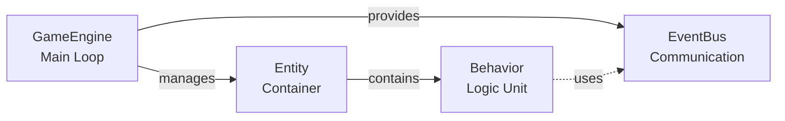
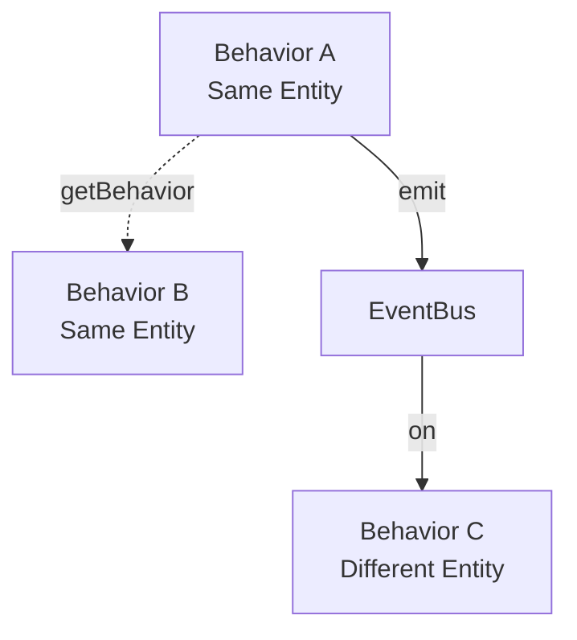

# Tiny Engine Documentation

Welcome to Tiny Engine—a minimal, headless game engine for tick-based simulations.

## 📚 Documentation Guide

### New to Tiny Engine?

Start here and follow in order:

1. **[Introduction](01-introduction.md)**
   What is Tiny Engine and why does it exist?

2. **[Core Concepts](02-core-concepts.md)**
   Understand the four pillars: GameEngine, Entity, Behavior, EventBus

3. **[Your First Simulation](03-your-first-simulation.md)**
   Build a working simulation in 5 minutes

### Building Simulations

Once you understand the basics:

4. **[Behaviors](04-behaviors.md)**
   Master behavior patterns and lifecycle

5. **[Events](05-events.md)**
   Learn event-driven architecture and communication

### Production Ready

Take your simulations to production:

6. **[Advanced Patterns](06-advanced-patterns.md)**
   Multi-entity systems, Monte Carlo, optimization

7. **[Best Practices](07-best-practices.md)**
   Design principles and conventions

### Reference

When you need to look something up:

8. **[API Reference](08-api-reference.md)**
   Complete API documentation

---

## 🎯 Quick Links

### I want to...

**...understand what Tiny Engine is**
→ [Introduction](01-introduction.md)

**...build my first simulation**
→ [Your First Simulation](03-your-first-simulation.md)

**...understand behavior execution order**
→ [Behaviors: Priority Ordering](04-behaviors.md#priority-matters)

**...make entities communicate**
→ [Events](05-events.md)

**...build a racing simulator**
→ [Advanced Patterns](06-advanced-patterns.md) + [Best Practices](07-best-practices.md)

**...run Monte Carlo simulations**
→ [Advanced Patterns: Monte Carlo](06-advanced-patterns.md#monte-carlo-patterns)

**...debug my simulation**
→ [Advanced Patterns: Debugging](06-advanced-patterns.md#debugging-techniques)

**...look up a method**
→ [API Reference](08-api-reference.md)

---

## 🚀 Quick Start

```typescript
import { GameEngine, Entity, Behavior } from '@/lib/tiny-engine';

// 1. Create a behavior
class MovementBehavior extends Behavior {
  position = 0;
  velocity = 10;

  override onUpdate(dt: number): void {
    this.position += this.velocity * dt;
  }
}

// 2. Setup simulation
const engine = new GameEngine();
const entity = new Entity('test');
entity.addBehavior(new MovementBehavior());
engine.addEntity(entity);

// 3. Run
engine.run(2.0, 0.016);

// 4. Results
const movement = entity.getBehavior(MovementBehavior);
console.log(movement?.position); // 20.0
```

---

## 📖 Learning Paths

### Path 1: Quick Learner (15 minutes)

Perfect if you just need to get something working:

1. [Introduction](01-introduction.md) (3 min)
2. [Your First Simulation](03-your-first-simulation.md) (10 min)
3. Start building!

### Path 2: Thorough Understanding (1 hour)

For building production systems:

1. [Introduction](01-introduction.md)
2. [Core Concepts](02-core-concepts.md)
3. [Your First Simulation](03-your-first-simulation.md)
4. [Behaviors](04-behaviors.md)
5. [Events](05-events.md)
6. [Best Practices](07-best-practices.md)

### Path 3: Reference Reader

Already familiar with game engines? Jump to:

1. [Core Concepts](02-core-concepts.md) - Quick overview
2. [API Reference](08-api-reference.md) - Complete API
3. [Best Practices](07-best-practices.md) - Conventions

---

## 🧪 Examples

All concepts are demonstrated in working tests:

- **[Behavior.test.ts](../__tests__/Behavior.test.ts)** - Behavior lifecycle and features
- **[Entity.test.ts](../__tests__/Entity.test.ts)** - Entity management and behavior queries
- **[EventBus.test.ts](../__tests__/EventBus.test.ts)** - Event pub/sub patterns
- **[GameEngine.test.ts](../__tests__/GameEngine.test.ts)** - Engine features and edge cases
- **[integration.test.ts](../__tests__/integration.test.ts)** - **⭐ START HERE** - Complete real-world examples

**Pro tip**: Read `integration.test.ts` for practical patterns you can copy into your own code.

---

## 🎓 Concepts At a Glance

### The Four Pillars



### Execution Flow

```
GameEngine.tick(dt)
  ├─> Advance time
  ├─> Update Entity 1
  │     ├─> Behavior A (priority: -10)
  │     ├─> Behavior B (priority: 0)
  │     └─> Behavior C (priority: 10)
  ├─> Update Entity 2
  │     └─> Behavior D
  └─> Emit 'tick' event
```

### Communication Patterns



---

## 🛠️ Development

### Running Tests

```bash
bun test src/lib/tiny-engine/__tests__/
```

### Type Checking

All code is fully typed with TypeScript. No `any` types in the public API.

### Zero Dependencies

Tiny Engine has only one dependency: `eventemitter3` (for the EventBus). No other external dependencies.

---

## 🤝 Contributing

Found an issue or want to improve the docs?

1. Check the existing documentation structure
2. Follow the Laravel Docs style (example-first, conversational)
3. Include working code examples
4. Test your examples actually work

---

## 📝 Documentation Conventions

- **Examples first** - Show code before explaining
- **Progressive disclosure** - Start simple, add complexity
- **Conversational tone** - Write like you're teaching a friend
- **Working code** - All examples should run as-is
- **Clear structure** - Each page has one clear purpose

---

## 🔗 External Resources

### Dependencies

- [eventemitter3](https://github.com/primus/eventemitter3) - Fast, typed event emitter

### Related Docs

- [Race Mechanics](../../../../docs/race-mechanics.md) - Uma Musume racing mechanics
- [Quick Reference](../../../../docs/quick-reference.md) - Racing mechanic checklist
- [ADR 002](../../../../docs/adr/simulation/002-simulation-engine.md) - Engine architecture decisions

---

## 📬 Feedback

Questions or suggestions? Open an issue or start a discussion in the repository.

---

## Version History

- **v1.0.0** (2025-12-21) - Initial release
  - Core engine implementation
  - Complete test suite (145 tests)
  - Full documentation

---

## License

Tiny Engine is part of the umalator-global project and shares its license.

See [LICENSE](../../../../LICENSE) for details.
