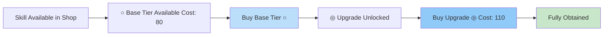
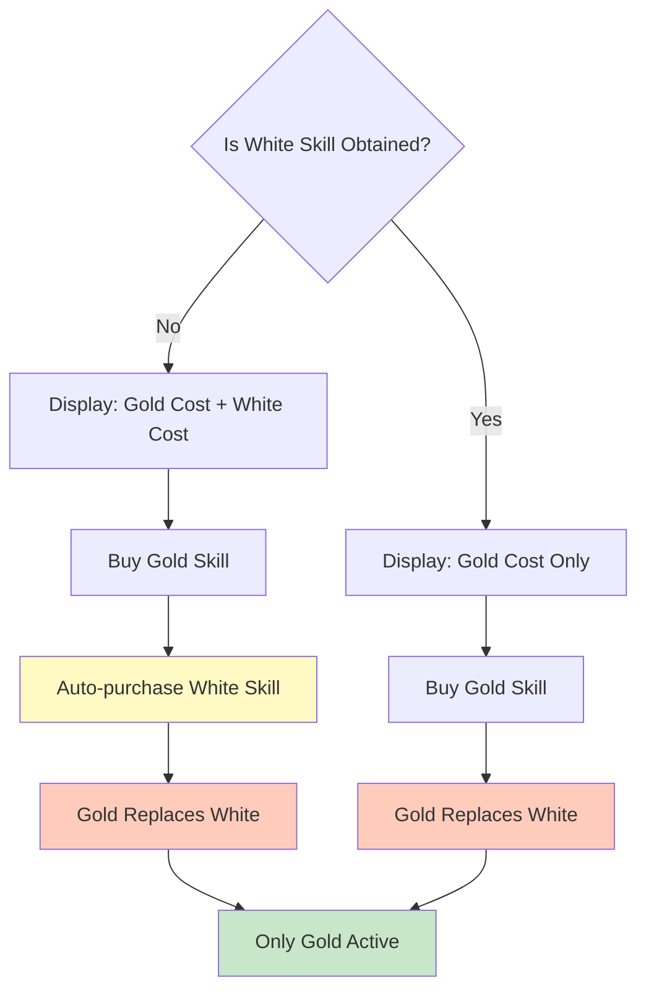
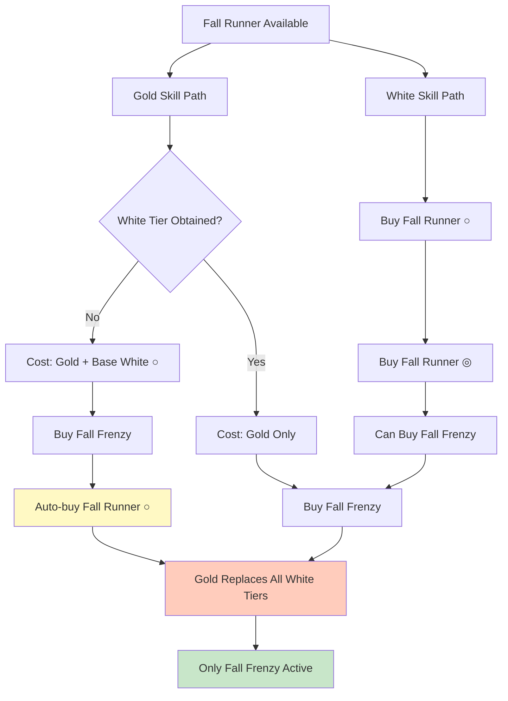

# Skill Planner Module

## Overview

The Skill Planner module is designed for **Career Mechanics** in Umamusume: Pretty Derby, not race mechanics. It provides tools to simulate and optimize skill combinations within a skill point budget, helping players make informed decisions about which skills to purchase for their runners.

### Key Features

- Calculate effective skill costs with hint levels and Fast Learner discount
- Manage candidate skills with their acquisition metadata
- Optimize skill combinations to maximize performance within budget constraints
- Track optimization progress and analyze results

---

## Module Structure

### Core Files

#### [`types.ts`](./types.ts)

Core type definitions for the skill planner system.

**Key Types:**

- `CandidateSkill` - Represents a skill being considered for purchase with metadata
- `OptimizationResult` - Complete results from skill optimization including statistics
- `CombinationResult` - Individual skill combination with cost and performance data
- `OptimizationProgress` - Progress tracking during optimization
- `HintLevel` - Type for hint levels (0-5)

#### [`skill-planner.store.ts`](./skill-planner.store.ts)

Zustand store managing the skill planner state and actions.

**State:**

- `runner` - Current runner configuration
- `candidates` - Record of candidate skills being considered
- `budget` - Available skill points
- `hasFastLearner` - Whether the runner has the Fast Learner skill
- `isOptimizing` - Optimization in progress flag
- `progress` - Current optimization progress
- `result` - Optimization results

**Key Actions:**

- `addCandidate()` / `removeCandidate()` - Manage candidate skills
- `setCandidateHintLevel()` - Update hint level for a skill
- `setCandidateObtained()` - Mark skill as already owned
- `setBudget()` - Set available skill points
- `setHasFastLearner()` - Toggle Fast Learner modifier

#### [`cost-calculator.ts`](./cost-calculator.ts)

Calculates effective skill costs with all discounts applied.

**Functions:**

- `calculateSkillCost()` - Calculate final cost with all modifiers
- `getBaseCost()` - Get base cost without discounts

---

## Cost Calculation System

### Formula

The effective cost of a skill is calculated as:

```
effectiveCost = floor(baseCost × (1 - hintDiscount) × fastLearnerMultiplier)
```

Where:

- `baseCost` - The skill's base cost from skill metadata
- `hintDiscount` - Discount percentage based on hint level (0-40%)
- `fastLearnerMultiplier` - 0.9 if runner has Fast Learner, 1.0 otherwise
- `floor()` - Result is always rounded down

### Hint Level Discounts

| Hint Level | Discount | Description      |
| ---------- | -------- | ---------------- |
| 0          | 0%       | No hint          |
| 1          | 10%      | Basic hint       |
| 2          | 20%      | Improved hint    |
| 3          | 30%      | Strong hint      |
| 4          | 35%      | Very strong hint |
| 5          | 40%      | Maximum hint     |

### Fast Learner Modifier

The **Fast Learner** skill provides a 10% discount on all skill purchases:

- Without Fast Learner: multiplier = 1.0
- With Fast Learner: multiplier = 0.9

This discount stacks multiplicatively with hint level discounts.

### Cost Calculation Examples

#### Example 1: Base Cost Only

```
baseCost = 110
hintLevel = 0
hasFastLearner = false

effectiveCost = floor(110 × 1.0 × 1.0) = 110
```

#### Example 2: With Hint Level 3

```
baseCost = 110
hintLevel = 3 (30% discount)
hasFastLearner = false

effectiveCost = floor(110 × 0.7 × 1.0) = 77
```

#### Example 3: With Fast Learner

```
baseCost = 110
hintLevel = 0
hasFastLearner = true

effectiveCost = floor(110 × 1.0 × 0.9) = 99
```

#### Example 4: Maximum Discounts

```
baseCost = 110
hintLevel = 5 (40% discount)
hasFastLearner = true

effectiveCost = floor(110 × 0.6 × 0.9) = floor(59.4) = 59
Total discount: 46.4%
```

---

## Candidate Skills

### CandidateSkill Interface

```typescript
interface CandidateSkill {
  skillId: string; // Unique skill identifier
  hintLevel: HintLevel; // 0-5 hint level
  isObtained: boolean; // Already owned, excluded from budget
  isStackable: boolean; // Can be purchased multiple times
  effectiveCost: number; // Calculated with all discounts applied
}
```

### Managing Candidates

**Adding a Candidate:**

```typescript
addCandidate(skillId: string, hintLevel?: number)
```

**Updating Hint Level:**

```typescript
setCandidateHintLevel(skillId: string, hintLevel: number)
```

Recalculates `effectiveCost` automatically.

**Marking as Obtained:**

```typescript
setCandidateObtained(skillId: string, isObtained: boolean)
```

Obtained skills are excluded from budget calculations.

**Removing a Candidate:**

```typescript
removeCandidate(skillId: string)
```

---

## Optimization Pipeline

The optimization system finds the best skill combinations within budget constraints.

### OptimizationResult

```typescript
type OptimizationResult = {
  skillsToBuy: ReadonlyArray<string>; // Optimal skill IDs
  totalCost: Readonly<number>; // Total cost of combination
  bashinStats: Readonly<{
    // Performance statistics
    min: number;
    max: number;
    mean: number;
    median: number;
  }>;
  simulationCount: Readonly<number>; // Number of simulations run
  timeTaken: Readonly<number>; // Optimization duration (ms)
  allResults: ReadonlyArray<CombinationResult>; // All tested combinations
  runData?: Readonly<SimulationData>; // Full simulation for visualization
};
```

### Progress Tracking

During optimization, progress updates are provided:

```typescript
interface OptimizationProgress {
  completed: number; // Combinations tested
  total: number; // Total combinations to test
  currentBest: CombinationResult | null; // Best found so far
}
```

---

## Skill Acquisition Mechanics

### Overview

This section documents the game mechanics for skill acquisition in Umamusume: Pretty Derby. These mechanics are **not yet fully implemented** but are specified here for future development.

---

### Stackable Skills

Some skills can be purchased multiple times, with each purchase unlocking a higher tier.

#### Characteristics

- **Tiers**: Skills have up to 2 tiers, marked with symbols:
  - Tier 1: ○ (Base)
  - Tier 2: ◎ (Upgrade)
- **Unlock Chain**: Player only sees one tier at a time in the shop
  - Player sees the base tier (○) available for purchase
  - Must buy ○ to unlock ◎
- **Replacement Behavior**: Higher tiers REPLACE lower tiers
  - Only the highest purchased tier applies to the runner
  - Buying ◎ removes ○ effect
- **Individual Costs**: Each tier has its own cost value
- **Hint Levels**: Each tier can have its own hint level

#### Examples

**Kyoto Racecourse (2 tiers):**

1. Kyoto Racecourse ○ (Base tier)
2. Kyoto Racecourse ◎ (Upgrade tier)

**Medium Corners (2 tiers):**

1. Medium Corners ○ (Base tier)
2. Medium Corners ◎ (Upgrade tier)

**Fall Runner (2 tiers):**

1. Fall Runner ○ (Base tier)
2. Fall Runner ◎ (Upgrade tier)

#### Visual Flow



---

### White/Gold Skill Relationships

Gold skills are upgraded versions of white skills with enhanced effects.

#### Characteristics

- **Rarity**: White skills (rarity=1), Gold skills (rarity=2)
- **Auto-Bundle**: Buying a Gold skill automatically purchases its related white skill
- **Cost Display**:
  - If white skill NOT obtained: Gold cost = Gold base cost + White base cost
  - If white skill IS obtained: Gold cost = Gold base cost only
- **Replacement**: Gold version always replaces the white skill
  - The white skill is removed from the runner
  - Only the Gold skill applies

#### Examples

**Preferred Position (White) → Race Planner (Gold)**

- White skill "Preferred Position" costs 90 points
- Gold skill "Race Planner" has base cost 110 points
- If white not obtained: Race Planner shows cost of 200 (110 + 90)
- If white obtained: Race Planner shows cost of 110
- Buying Race Planner replaces Preferred Position

**Right-Handed (White) → Right-Handed Demon (Gold)**

- Right-Handed ◎ (white) costs 110 points
- Right-Handed Demon (gold) has base cost 130 points
- Combined cost if white not obtained: 240 points

#### Visual Flow



---

### Stackable Skills with Gold Versions

Some stackable white skills have corresponding Gold versions that provide enhanced effects.

#### Characteristics

- **Base Tier Auto-Buy**: Buying the Gold skill automatically purchases only the **base tier** of the white skill
  - Example: Buying "Fall Frenzy" (Gold) auto-buys "Fall Runner ○" (not × or ◎)
- **Cost Calculation**: Gold display cost = Gold base cost + Base white tier cost
- **Replacement**: Gold replaces the white skill entirely
  - All white skill tiers are removed
  - Only the Gold skill applies

#### Example: Fall Runner Series

**White Skill Tiers:**

1. Fall Runner ○ (Base tier) ← Base tier for gold auto-buy
2. Fall Runner ◎ (Upgrade tier)

**Gold Version:**

- Fall Frenzy (Gold)

**Acquisition Scenarios:**

1. **No white skills obtained:**
   - Fall Frenzy cost = Fall Frenzy base + Fall Runner ○ base
   - Buying Fall Frenzy auto-purchases Fall Runner ○
   - Gold replaces white skill

2. **Fall Runner ○ already obtained:**
   - Fall Frenzy cost = Fall Frenzy base only
   - Buying Fall Frenzy removes Fall Runner ○
   - Gold replaces white skill

3. **Fall Runner ◎ already obtained:**
   - Fall Frenzy cost = Fall Frenzy base only (○ already counted in ◎ purchase)
   - Buying Fall Frenzy removes Fall Runner ◎
   - Gold replaces white skill

#### Visual Flow



---

## Data Model Specifications

### Leveraging Existing Data

The skill relationship data already exists in the GameTora skills dataset through the `versions` field.

#### Structure

Each skill in `gametora/skills.json` contains:

```typescript
interface ISkill {
  id: number; // Skill ID
  rarity: number; // 1=White, 2=Gold, 3+=Unique, 6=Evolution
  cost?: number; // Base cost (if purchasable)
  versions?: Array<number>; // Related skill IDs (all tiers + gold)
  // ... other fields
}
```

### Relationship Detection

#### Stackable Skills

Multiple white skills (rarity=1) in the same `versions` group indicate stackable tiers:

```typescript
// Example: Right-Handed family (simplified, showing only purchasable tiers)
{
  "id": 200011,
  "name_en": "Right-Handed ◎",
  "rarity": 1,
  "cost": 110,
  "versions": [200012, 200014]
}
{
  "id": 200012,
  "name_en": "Right-Handed ○",
  "rarity": 1,
  "cost": 90,
  "versions": [200011, 200014]
}
```

**Detection Logic:**

- Filter `versions` array for skills with rarity=1
- If count > 1, skill is stackable
- Sort by cost to determine tier order:
  - Lowest cost = Tier 1 (○ base tier)
  - Highest cost = Tier 2 (◎ upgrade tier)

#### Gold Skills

A gold skill (rarity=2) in the `versions` group indicates the upgraded version:

```typescript
{
  "id": 200014,
  "name_en": "Right-Handed Demon",
  "rarity": 2,
  "cost": 130,
  "versions": [200011, 200012]
}
```

**Detection Logic:**

- Filter `versions` array for skill with rarity=2
- If exists, this is the gold version for the white skill(s)
- White skills should reference this gold ID

#### Determining Base Tier

For stackable skills with a gold version, the base tier is:

- The white skill tier with the **lowest cost** among white tiers
- Typically marked with ○ symbol
- This is the tier that players start with and is used for gold skill auto-buy

```typescript
// Example: Right-Handed tiers
Right-Handed ○ (200012): 90  ← Tier 1 (BASE TIER - used for gold auto-buy)
Right-Handed ◎ (200011): 110 ← Tier 2 (Upgrade tier)

Right-Handed Demon (200014): 130 + 90 (base tier) = 220 (if no white obtained)
```

### Proposed Extensions

To fully support these mechanics, consider extending the `CandidateSkill` type:

```typescript
interface CandidateSkill {
  skillId: string;
  hintLevel: HintLevel;
  isObtained: boolean;

  // Stackable support
  isStackable: boolean;
  tierLevel?: number; // 1 (○/base) or 2 (◎/upgrade) for stackable skills
  nextTierId?: string; // Next tier to unlock
  previousTierId?: string; // Previous tier (replaced by this)

  // Gold/White relationship
  isGold: boolean; // Is this a gold skill?
  whiteSkillId?: string; // Related white skill (for gold)
  goldSkillId?: string; // Related gold skill (for white)
  baseTierIdForGold?: string; // Base tier auto-bought with gold

  // Cost calculation
  effectiveCost: number; // Final cost with all modifiers
  displayCost?: number; // Cost shown to user (may include white cost)
}
```

---

## Testing

The module includes comprehensive unit tests:

- [`__tests__/cost-calculator.test.ts`](./__tests__/cost-calculator.test.ts) - Cost calculation logic
- [`__tests__/store.test.ts`](./__tests__/store.test.ts) - Store actions and state management

Run tests with:

```bash
pnpm run test src/modules/skill-planner/
```

---

## Future Implementation Notes

### Priority Tasks

1. **Skill Relationship Parser**
   - Parse `versions` field from GameTora data
   - Build skill family maps (stackable tiers, gold relationships)
   - Identify base tiers for gold auto-buy

2. **Enhanced Cost Calculator**
   - Support bundled costs (gold + white)
   - Handle stackable tier progression
   - Calculate display costs vs. effective costs

3. **Store Updates**
   - Track which tiers are unlocked/visible
   - Manage gold/white replacement logic
   - Update candidate management for stackable skills

4. **UI Components**
   - Display skill tier progression
   - Show gold/white relationships
   - Indicate auto-bundled skills

### Best Practices

- **Avoid Circular Dependencies**: Per project memory, avoid barrel files (index.ts re-exports)
- **Direct Imports**: Import directly from specific files
- **Type Safety**: Use strict TypeScript types for skill relationships
- **Immutability**: Maintain immutable state in Zustand store

---

## Related Modules

- [`@/modules/skills`](../skills/) - Skill metadata and utilities
- [`@/modules/simulation`](../simulation/) - Race simulation engine
- [`@/modules/runners`](../runners/) - Runner state management

---

## Contributing

When modifying this module:

1. Update type definitions in [`types.ts`](./types.ts)
2. Add/update tests for new functionality
3. Recalculate costs when modifiers change
4. Document new mechanics in this README
5. Follow the project's TypeScript and import conventions
